# Vector — How It Works

### A Complete Architecture Manual

*From the first page load to the database and back — written for everyone, from the curious newcomer to the engineer.*

---

**Document status:** Golden-state snapshot, verified against the live codebase on **6 June 2026.**
**Audience:** Layered. Every chapter opens with an **"In one breath"** plain-English summary anyone can read. Below that line, the same topic is told again in full technical depth.
**How to read it:** If you have never touched code, read only the *"In one breath"* boxes and the diagrams — you will come away understanding the whole system. If you build software, keep reading past each box for the file names, the exact mechanisms, and the reasoning.

> **A note on trust.** Every technical claim in this manual was checked against the actual source code — not documentation, not memory. Where an internal note disagreed with the running code, the code won. This is a *source of truth*, not a sketch.

---

<a id="toc"></a>
## Table of Contents

1. [What Vector Is — and the Ideas Underneath It](#ch1)
2. [The Technology Stack — The Materials We Built With](#ch2)
3. [The Runtime — What Talks to What, and Where It Lives](#ch3)
4. [The First Page — What Happens When You Open Vector](#ch4)
5. [Logging In — Proving You Are You](#ch5)
6. [Staying Logged In — Sessions, Silent Refresh, and Idle Timeout](#ch6)
7. [Sentinel — The Heart of "Who Can See What"](#ch7)
8. [Navigation — How Your Two Rails Are Built](#ch8)
9. [The Life of a Click — One Action, End to End](#ch9)
10. [Live Updates — REST, WebSockets, and the Outbox](#ch10)
11. [Security — The Layers an Attacker Must Defeat](#ch11)
12. [Why We Built It This Way — The Decisions Behind the Design](#ch12)
13. [Glossary / Index — Every Term in Plain English](#index)

---

<a id="ch1"></a>
## 1. What Vector Is — and the Ideas Underneath It

> **In one breath.** Vector is a web application — a website you log into and work inside, like a more powerful, more secure version of a project-planning tool. Two big ideas shape every part of it. The first is **"Trust No One"**: the program assumes any request *could* be an attacker, so it re-checks permission on the server for everything, every time. The second is **"the server is the gate"**: the part of the system the user's browser can touch is never trusted to decide what data a person is allowed to see — that decision is always made on a separate, protected computer the user cannot reach. Those two ideas explain almost every design choice in the rest of this manual.

Vector is a **multi-tenant** business application. "Multi-tenant" means many separate organisations (called *tenants* or *subscriptions*) all use the same running software, but each one's data is walled off so completely that one tenant can never see another's — even though they share the same database. Think of an office building: many companies, one building, but each company's floor has its own locked door and nobody holds a master key that opens every floor at once.

Inside a tenant, people are organised into **workspaces** and a tree of **topology nodes** (think departments, teams, programmes, projects — a hierarchy). A person's view of the data is *clamped* to the part of that tree they have been granted access to. This clamping is the spine of the whole product, and it has its own chapter ([Chapter 7](#ch7)).

The product is being built to a **defence and finance grade** of security. That is not marketing language — it sets a concrete bar. Buyers in those industries hold software to published standards (SOC 2 Type II, ISO 27001, NIST 800-53, CMMC, PCI-DSS). The practical effect is that "we'll add security later" is never an acceptable answer in Vector. Security is part of the definition of "done" for every feature, and the manual will show you exactly where it lives.

### The two principles, stated once, clearly

**Trust No One.** Every request arriving at the server is treated as potentially hostile, even one that *looks* like it came from a logged-in user. The server independently re-verifies identity, tenant, scope, and permission on every single request. Nothing is taken on faith because "the user was logged in a moment ago."

**The server is the gate.** The browser (the "client") is helpful but never authoritative. If a screen hides an "Admin" button because you are not an admin, that is a *convenience* — it keeps the screen tidy. The *real* protection is that the server would refuse the admin action even if you found a way to click the hidden button. In Vector's own words, written into its engineering rules: *"The wire payload returned to a caller must not contain data the caller isn't cleared for — hiding it in the client is the wrong answer."* You will see this principle enforced literally, in code, throughout the manual.

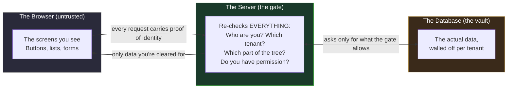

Keep this picture in your head. Every chapter that follows is, in some sense, a detailed tour of one part of it.

---

<a id="ch2"></a>
## 2. The Technology Stack — The Materials We Built With

> **In one breath.** Vector is built from three main materials. The **front** (what you see and click) is built with **Next.js and React** — the industry-standard way to build fast, modern, interactive web screens. The **back** (the gate, where the real decisions are made) is built in **Go**, a language prized for being fast, simple, and very hard to write security bugs in. The **memory** (where all the data lives) is **PostgreSQL**, one of the most trusted databases in the world. These three are wrapped in **Docker** containers so they run identically everywhere. Think of it as: a beautiful, responsive shopfront (Next.js), a disciplined and secure back office (Go), and a fireproof vault (PostgreSQL).

Let's meet each material and say *why* it was chosen. The "why" matters — these were deliberate choices, not defaults.

### 2.1 The front end — Next.js + React

The screens are built with **Next.js version 15** running **React 18**, written in **TypeScript** (a stricter, safer dialect of JavaScript that catches mistakes before they ship). This is confirmed in the project's `package.json` — Next `^15.0.0`, React `^18.3.1`, TypeScript `^5`.

- **React** is the toolkit for building user interfaces out of small reusable pieces called *components*. A button, a grid, a navigation rail — each is a component.
- **Next.js** is the framework that wraps React to make it production-grade: it handles page routing, server-side rendering for speed, and a security layer that runs on every page request (we'll meet that layer — the *edge middleware* — in [Chapter 5](#ch5) and [Chapter 11](#ch11)).
- Vector uses Next.js's modern **App Router** (the `app/` directory layout), the current best-practice structure.

In development, the screens run on a local server at **port 5101**, started with `next dev --turbo` — "Turbo" being Turbopack, a very fast bundler that rebuilds the screen in milliseconds as a developer types.

The toolbox bundled in is rich and purpose-chosen: `@dnd-kit` for drag-and-drop reordering, `@tiptap` for rich-text editing, `@xyflow/react` and `cytoscape` and `three` for the diagram and graph canvases, `framer-motion` and `gsap` for animation, and — importantly for security — `isomorphic-dompurify` for scrubbing any user-supplied HTML clean of attacks before it is ever shown.

### 2.2 The back end — Go

The gate — the part that makes every real decision — is written in **Go** (sometimes called Golang). Go was created at Google to be fast like C but simple and safe like a scripting language. It is a deliberate choice for a security-critical back end:

- It compiles to a single fast binary with no heavy runtime.
- Its simplicity means there are fewer dark corners where bugs hide.
- Its strong typing and explicit error handling make it hard to "forget" to check something.

Vector's Go server uses a lightweight, well-respected web router called **chi** (`go-chi/chi/v5`). It listens on **port 5100**. Every request that arrives passes through a chain of small gatekeepers called *middleware* — we will trace that exact chain in [Chapter 9](#ch9) and [Chapter 11](#ch11), because it *is* the security model in motion.

The Go code is organised into roughly sixty small **service packages** under `backend/internal/`, each owning one job. A few you'll meet by name in this manual:

| Package | Its one job |
|---|---|
| `auth` | Logging in, sessions, multi-factor, token issuance |
| `sentinel` | Resolving *who you are / which tenant / which part of the tree* — the clamp |
| `nav` | Building your navigation rails |
| `artefactitems` | The work-items and portfolio-items you actually manage |
| `permissions` | Checking whether your role is allowed to do a thing |
| `audit` | Writing the permanent, tamper-resistant record of what happened |
| `secrets` | Decrypting sensitive configuration at startup |
| `realtime` | Pushing live updates to the browser over a WebSocket |
| `searchworker` | Building the search index in the background |

This "one package, one job" discipline is itself a security feature: it means the rules about (say) who may change a role live in exactly one place, and the code is *linted* (automatically checked) to make sure nobody writes to those tables from anywhere else. More on that in [Chapter 11](#ch11).

### 2.3 The database — PostgreSQL

All data lives in **PostgreSQL** (Postgres), a mature, open-source relational database trusted by banks, governments, and the largest technology companies. Vector actually uses **two** Postgres databases, and the distinction is important:

| Database | Role |
|---|---|
| **`vector_artefacts`** | The **canonical tenant database** — every tenant's users, sessions, workspaces, roles, the topology tree, the work items, the audit log. Everything that belongs to a customer lives here, walled off by tenant. |
| **`mmff_library`** | A **read-only "library" spine** — a shared catalogue of published reference content (portfolio models, error-code definitions) that MMFF publishes and tenants consume but cannot alter. |

(A third small database, `mmff_dev`, holds only internal developer reports and is not part of the product surface.)

The Go server talks to Postgres using a high-performance driver called **pgx** (specifically its connection-pool form, `pgxpool`). Every query is *parameterised* — a phrase that will recur — meaning user input is never glued directly into a database command. This single discipline closes off the entire category of attack known as **SQL injection**. We'll see exactly how in [Chapter 9](#ch9).

### 2.4 The wrapper — Docker

The database, plus a fast in-memory cache called **Valkey** (a Redis-compatible store) and a couple of admin tools, run inside **Docker containers** orchestrated by **Docker Swarm**. A container is a sealed, portable box that holds a program and everything it needs to run, so it behaves identically on a developer's laptop and on a production server. This eliminates the classic "but it worked on my machine" problem and gives a clean, reproducible foundation.

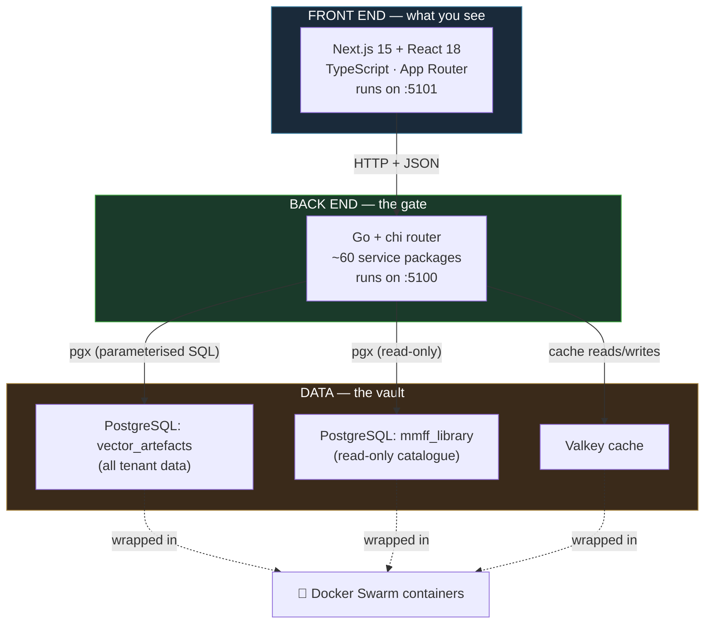

---

<a id="ch3"></a>
## 3. The Runtime — What Talks to What, and Where It Lives

> **In one breath.** When the system is actually running, there is a clear chain of hand-offs. Your browser talks to the Next.js screen-server. The browser's little data requests go *straight* to the Go gate (there is no middle-man proxy). The Go gate talks to PostgreSQL — but PostgreSQL doesn't live on the developer's computer; it lives on a remote server, reached through a secure private tunnel. So a single piece of data travels: browser → Go gate → secure tunnel → remote database → and all the way back. Each hop has a specific address (a "port"), and knowing the chain is the key to understanding everything else.

This chapter is the map. Once you can see the runtime topology, the later chapters — login, navigation, the life of a click — are just journeys *along this map*.

### 3.1 The hops, one at a time

In the development environment (the one engineers work in daily), the chain looks like this:

```
┌──────────────────────────────────────────────────────────────────────────┐
│  YOUR BROWSER                                                              │
│  Loads screens from localhost:5101                                        │
└───────────────┬──────────────────────────────────────────────────────────┘
                │  (1) Loads the page itself  — HTTP
                ▼
┌──────────────────────────────────────────────────────────────────────────┐
│  NEXT.JS DEV SERVER          localhost:5101  (Turbopack)                   │
│  Serves the HTML + JavaScript for every screen.                           │
│  Runs the per-request security middleware (the CSP nonce — see Ch.11).    │
└───────────────┬──────────────────────────────────────────────────────────┘
                │  (2) The screen's JavaScript makes data calls.
                │      These go DIRECTLY to the Go gate — no proxy.
                │      Each carries: Authorization (JWT) + DPoP proof + CSRF token
                ▼
┌──────────────────────────────────────────────────────────────────────────┐
│  GO BACKEND (THE GATE)       localhost:5100  (chi router)                  │
│  Middleware chain runs on every request:                                  │
│  RequestID → Logger → Recoverer → CORS → SecurityHeaders →                │
│  BodyLimit → CSRF → [per route] Auth → FreshPassword →                    │
│  RateLimit → Sentinel clamp → the handler                                 │
└───────────────┬──────────────────────────────────────────────────────────┘
                │  (3) The handler asks the database, via pgx pools.
                ▼
┌──────────────────────────────────────────────────────────────────────────┐
│  SSH TUNNEL                  localhost:5435  ──►  77.68.33.216:5432        │
│  A private, encrypted pipe. The database is NOT on the laptop.            │
└───────────────┬──────────────────────────────────────────────────────────┘
                │  (4) Through the tunnel to the remote server.
                ▼
┌──────────────────────────────────────────────────────────────────────────┐
│  REMOTE VPS (Docker Swarm)   77.68.33.216                                 │
│  PostgreSQL container, port 5432 inside.                                  │
│  Databases: vector_artefacts · mmff_library · mmff_dev                    │
└──────────────────────────────────────────────────────────────────────────┘
```

A few things deserve a plain-English highlight, because they are easy to get wrong:

**There is no proxy in the middle.** A common assumption is that the browser's data requests are routed *through* the Next.js server on their way to the back end. They are not. The screen's JavaScript calls the Go gate directly at `localhost:5100`. The front-end's data client resolves its base address to exactly that, and the Next.js configuration contains *zero* rewrite rules that would redirect those calls. This matters because it means the security gate (the Go middleware chain) sees every data request first-hand; nothing is laundered through an intermediary.

**The database is remote, reached through a tunnel.** Even in development, PostgreSQL does not run on the engineer's laptop. It runs on a remote server (a VPS at `77.68.33.216`), inside a Docker container. The laptop reaches it through an **SSH tunnel** — a private encrypted pipe that makes the remote database *appear* to be at `localhost:5435`. This is a deliberate security posture: the database port is never exposed to the open internet; the only way in is through an authenticated SSH connection. (Staging and production databases live behind different, hard-locked tunnels and are entirely out of reach of normal development.)

**Three transport "lanes."** The Go gate exposes its routes under named prefixes — think of them as labelled lanes:

| Lane (URL prefix) | Carries | Who uses it |
|---|---|---|
| `/_site` | All the portal's own screens — login, navigation, admin, roles, workspaces | The browser, with a session |
| `/samantha/v2` | The public data plane — work items, topology, sprints, search | The browser *and* programmatic API keys |
| (root) | Infrastructure — health checks, the live WebSocket at `/ws` | Internal tooling and live updates |

This separation is not cosmetic. The two lanes have *different* authentication rules and *different* leakage protections, and a lint rule (an automated code check) forbids a developer from accidentally calling the wrong lane. We return to this in [Chapter 11](#ch11).

### 3.2 The connection pools — how Go reaches the right database

The Go server doesn't open a fresh database connection for every request — that would be slow. Instead it keeps **pools** of ready-made connections. There are a few, and which one a service receives decides which database it can touch:

- **`vaPool` / `servicePool`** → the `vector_artefacts` tenant database. Almost every service uses this.
- **`libPools`** (a read-only, a publish, and an acknowledge role) → the `mmff_library` catalogue.

When the server starts up, each service is handed exactly the pool it needs and no more. A service that only reads the library catalogue is given the read-only library pool — it is *structurally incapable* of writing tenant data. This is the principle of least privilege, enforced at wiring time.

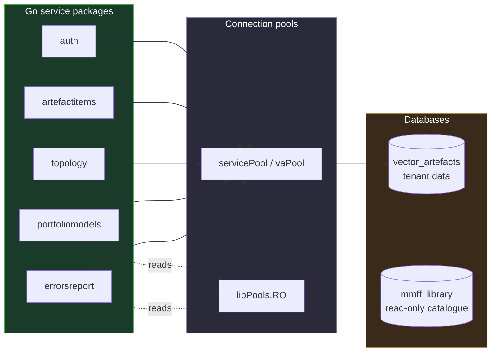

With the map in hand, we can now take the journeys.

---

<a id="ch4"></a>
## 4. The First Page — What Happens When You Open Vector

> **In one breath.** Before you have even typed a password, two things happen quietly. First, the Next.js page-server stamps a fresh, single-use security token (a *nonce*) onto the page, which lets the browser refuse to run any script that wasn't put there on purpose — a strong shield against injected-code attacks. Second, your browser quietly generates a unique cryptographic *keypair* and locks the private half away where no code can ever copy it. That key becomes the unforgeable "signature" your browser will use to prove every future request really came from this browser and not an impostor. So even the very first page load is laying security foundations.

When you navigate to Vector, the Next.js server doesn't just hand back a page. On *every single request*, a small piece of code called the **edge middleware** runs first (it lives in `middleware.ts`). It does two security-relevant jobs before the page is allowed to render.

**1. It mints a per-request nonce.** A *nonce* is a "number used once" — here, a fresh random value generated for this one page load (`crypto.randomUUID()`). The middleware stamps this nonce into the page's **Content-Security-Policy** — a set of rules the browser will obey about what is and isn't allowed to run. The rule, in plain terms, is: *"Only run a script if it carries tonight's exact password."* Because the nonce changes every request and is unguessable, an attacker who manages to inject a malicious `<script>` into the page cannot make it run — it doesn't have the password. We cover this shield in full in [Chapter 11](#ch11); the key point here is that it is active from the *first* byte of the *first* page.

**2. It checks whether you already have a session.** The middleware looks for a lightweight `session_alive` cookie. If you're not logged in and you're trying to reach a protected screen, it doesn't just bounce you to `/login` with your destination stapled visibly to the URL. Instead it routes you through a backend endpoint that validates the path, mints a *signed, sealed* continuation cookie, and then sends you to a clean `/login`. Your intended destination is preserved, but it never sits exposed in the address bar — a small, characteristic example of the "leave nothing for an attacker to tamper with" mindset.

Meanwhile, the moment the application's React code boots, a second quiet preparation happens — this one is the foundation of the entire login security model, so it gets its own section.

### 4.1 The browser forges its own unforgeable key

Vector uses a modern anti-theft technique called **DPoP** — *Demonstrating Proof-of-Possession* (an internet standard, RFC 9449). The idea is simple to state and powerful in effect: instead of a stolen "ticket" (token) being enough to impersonate you, every request must *also* be signed by a secret key that lives only in your browser and can never be extracted.

Here is how the browser sets that up, before you've even logged in (in `app/lib/dpop.ts`):

```javascript
keyPair = await crypto.subtle.generateKey(
  { name: "ECDSA", namedCurve: "P-256" },
  false,                  // ← non-extractable: the private key can NEVER be exported
  ["sign", "verify"],
);
```

Read that `false` carefully — it is one of the most important characters in the whole system. It tells the browser: *generate this keypair, but make the private key permanently non-exportable.* From that moment, the private key can be **used** to sign things, but no code anywhere — not the app, not a malicious script, not a browser extension — can ever read it out and carry it away. The key is generated using the browser's built-in **Web Crypto** engine (preferring the efficient ECDSA P-256 elliptic curve, falling back to RSA-2048 on browsers that need it) and stored in the browser's private **IndexedDB**.

Before login, the key is filed under an anonymous label. After you successfully log in, the app *re-parents* it to your real user identity and deletes every other stale key — so each user, on each device, has exactly one bound key.

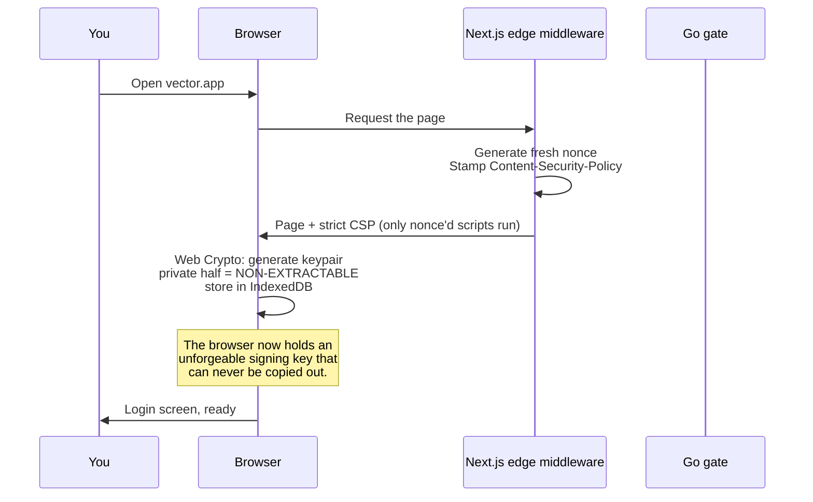

You haven't typed anything yet, and already the page is locked against injected scripts and your browser is armed with a key no thief can steal. *That* is what "security is part of done" looks like in practice.

---

<a id="ch5"></a>
## 5. Logging In — Proving You Are You

> **In one breath.** When you type your email and password and hit sign-in, your browser signs a one-time proof with its secret key and sends it alongside your credentials. The server checks your password against a securely scrambled stored version (it never stores the real password). If you use two-factor authentication, the server pauses and asks for your authenticator code. Once everything checks out, the server creates a *session* and hands back two things: a short-lived "access ticket" (valid 15 minutes) and a long-lived "renewal ticket" (valid 7 days) kept in a cookie the browser's scripts can't even read. From that point you are logged in — but, crucially, the access ticket alone is useless to a thief, because every request also needs a fresh signature from your unstealable key.

Let's walk the login from the button to the database and back.

### 5.1 Submitting your credentials

The login screen calls a `login(email, password)` function provided by **AuthContext** (`app/contexts/AuthContext.tsx`) — the one and only part of the front end responsible for credentials. It first ensures the DPoP keypair from [Chapter 4](#ch4) is ready, then POSTs your email and password to the `/_site/auth/login` endpoint. Attached to that request, in a header, is a freshly-signed DPoP proof.

```javascript
await ensureKeypair(DPOP_ANON_KEY);
const res = await apiSite("/auth/login", {
  method: "POST",
  body: JSON.stringify({ email, password }),
  skipAuth: true,
});
```

Notice what is *not* sent: the password is never stored, never logged, and travels only inside the encrypted request body.

### 5.2 What the server does with it

On the Go side, the `Login` handler (`backend/internal/auth/handler.go`) does something telling *before it even looks at your password*: it validates the DPoP proof and extracts the fingerprint (the *thumbprint*) of your browser's public key. If the proof is bad, it stops immediately. Only then does it call into the `auth` service to verify credentials.

The service (`backend/internal/auth/service.go`):

1. Looks up the user by email.
2. Confirms the account is active and not locked out.
3. Verifies the password against a **bcrypt** hash (work factor 12). Bcrypt is a deliberately slow, salted one-way scramble: the server never holds your actual password, only this hash, and even the hash is expensive to attack by brute force.
4. If the account has multi-factor enabled, it stops here and returns a short-lived (5-minute) *challenge token* instead of a session — the signal for the browser to ask for your authenticator code.
5. Otherwise, it creates a session row in the database, generates a refresh token, and signs an access token.

### 5.3 Multi-factor — the second factor

If you've enrolled in multi-factor authentication (MFA), the password is only step one. Vector uses standard **TOTP** — the six-digit rotating codes from an app like Google Authenticator or 1Password (30-second period, six digits; the very same standard your bank uses). Enrolment produces a QR code you scan once, plus a set of single-use recovery codes (each stored only as a bcrypt hash).

At login, after a correct password, the server hands back a 5-minute challenge token — and *nothing else*. That token carries no identity, no role, no access; it is useless for anything except being exchanged, together with a valid authenticator code, at `/auth/mfa/verify`. Only that exchange produces a real session.

There's a thoughtful convenience here too: a **"remember this device for 30 days"** option. Tick it, and the server sets a sealed, signed, browser-unreadable cookie specific to your user. On your next login from that device, the server sees the cookie and skips the code prompt — but only for 30 days, only on that device, and the trust evaporates the instant you disable MFA or clear cookies.

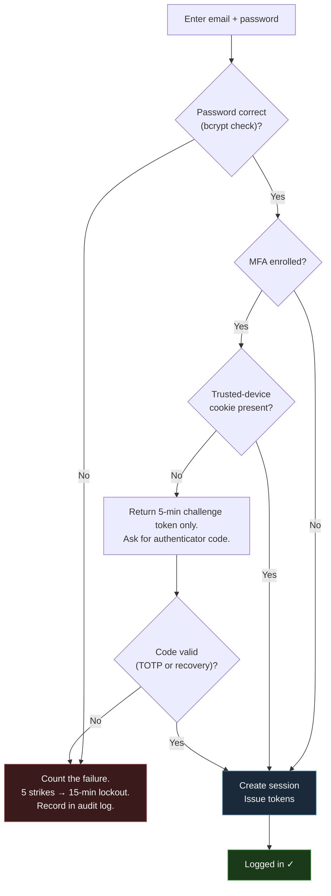

### 5.4 The two tickets — access token and refresh token

When login succeeds, the server issues two very different credentials. Understanding the difference is the key to understanding how Vector stays both secure *and* convenient.

**The access token** is a **JWT** (JSON Web Token) — a small, digitally-signed packet of facts about you. It is signed with HMAC-SHA256 using a secret only the server knows, so it cannot be forged or altered. Inside it are claims like your user id, email, role, subscription (tenant), workspace, the session id, and — critically — a `cnf.jkt` claim holding the *thumbprint of your DPoP key*. That last claim is the glue binding the ticket to your unstealable browser key. The access token is deliberately **short-lived: 15 minutes** by default.

```go
ttl := parseDurationEnv("JWT_ACCESS_TTL", 15*time.Minute)
// ...
var cnf *DPoPConfirmation
if dpopJKT != "" {
    cnf = &DPoPConfirmation{JKT: dpopJKT}   // bind token ↔ browser key
}
```

**The refresh token** is different in kind: a long, purely-random 64-character string (not a JWT, nothing readable inside it). It is valid for **7 days** and is delivered as a cookie named `rt` with three hardening flags: `HttpOnly` (JavaScript on the page literally cannot read it), `SameSite=Strict` (the browser won't attach it to requests originating from other sites), and `Secure` (only sent over HTTPS in production). The server never stores the refresh token itself — only a SHA-256 hash of it — so even a database leak would not hand an attacker a usable refresh token.

| | Access token | Refresh token |
|---|---|---|
| **What it is** | Signed JWT, readable claims | Random 64-char string |
| **Lifetime** | 15 minutes | 7 days |
| **Where it lives** | In the page's memory | `HttpOnly` cookie (`rt`) — unreadable by scripts |
| **What it proves** | "Here is who I am, right now" | "Let me get a fresh access token" |
| **Stored on server?** | No (verified by signature) | Only as a SHA-256 hash |
| **Bound to your key?** | Yes — via `cnf.jkt` thumbprint | Yes — checked on every refresh |

### 5.5 Why a stolen access token is useless — DPoP, plainly

Here is the payoff of all that keypair machinery. Suppose an attacker somehow captures your access token — say it leaked into a log file. With most systems, that token would be enough to impersonate you until it expired. **Not in Vector.**

Every single request must carry not just the access token but a *fresh DPoP proof*, signed in the moment by your browser's private key, and bound to that specific token (the proof contains `ath` = a hash of the exact access token). The server, on every request, checks three interlocking things:

1. The access token's signature is valid and unexpired.
2. The DPoP proof was signed by the same key whose thumbprint is recorded in the token's `cnf.jkt` claim.
3. The proof's one-time id (its `jti`) has never been seen before (a replay-attack guard backed by a database cache).

The attacker has the token but not the private key — and the private key is `non-extractable`, locked in *your* browser's IndexedDB. They cannot mint a valid proof. The stolen token is a key to a lock that has changed; it opens nothing.

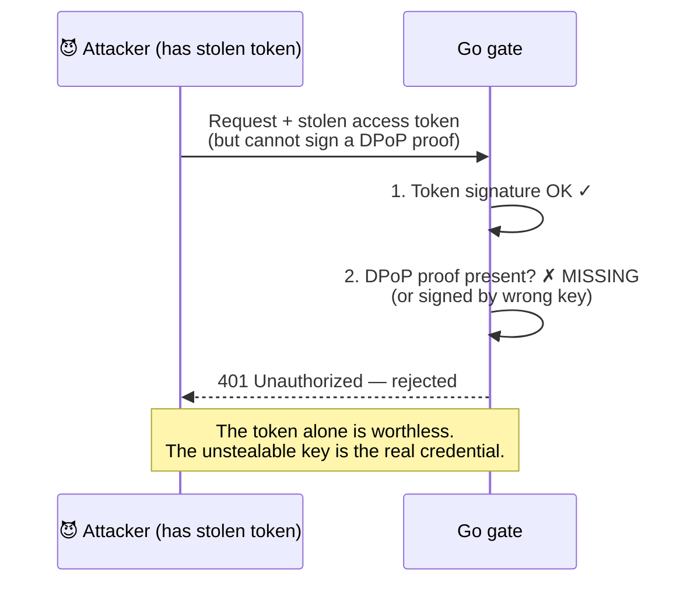

---

<a id="ch6"></a>
## 6. Staying Logged In — Sessions, Silent Refresh, and Idle Timeout

> **In one breath.** Your 15-minute access ticket expires often, on purpose — short tickets limit the damage if one ever leaks. But you never notice, because when a ticket expires the browser quietly trades the renewal cookie for a fresh ticket in the background and retries — no flicker, no re-login. Two things *will* log you out: if an administrator revokes your session, or if you go completely idle for 30 minutes. That idle clock is tracked on the server, not the browser, so it can't be faked. And if you have several tabs open, they coordinate: when one tab refreshes, the others adopt the new ticket instantly without hitting the network.

A short-lived access token is great for security but would be miserable for users if it meant logging in every 15 minutes. Vector resolves the tension with **silent refresh**.

### 6.1 Silent refresh — invisible re-ticketing

When a request comes back with a `401 Unauthorized` because the access token has expired, the front-end's data layer (`app/lib/api.ts`) doesn't surface an error. Instead it:

1. Inspects the failure code.
2. If it's an ordinary expiry, it calls the registered refresh routine — POSTing to `/_site/auth/refresh`. The refresh token rides along automatically in the `rt` cookie (the JavaScript never has to touch it), and a fresh DPoP proof is attached.
3. The server verifies the refresh token's hash, confirms the DPoP key still matches the one bound at login, **rotates** to a brand-new refresh token, and issues a new access token.
4. The original request is retried once, now with the new token. The user sees nothing but a momentary, invisible pause.

This refresh is also **deduplicated**: if ten requests fail at once because the token just expired, they all wait on a *single* shared refresh, not ten competing ones.

### 6.2 Refresh-token rotation and theft detection

Each refresh *rotates* the token — the old one is retired and a new one issued, with a brief grace window so concurrent tabs aren't stranded mid-rotation. This rotation is itself a tripwire. The refresh also re-checks that the DPoP key presenting the refresh matches the key that was bound to the session at login. If those don't match — the signature a thief on a different device would produce — the server treats it as a stolen-credential event and **revokes every session for that user at once**, slamming the door on all devices.

### 6.3 Idle timeout — tracked where it can't be faked

If you walk away, Vector logs you out after **30 minutes** of genuine inactivity. The important detail is *where* this is measured: on the **server**, on your session row, in a `last_used_at` column — never on a clock the browser controls (which could be tampered with).

On each authenticated request, the gate checks how long it has been since your session was last active. If it exceeds the 30-minute idle window, the request is refused with a specific code, `session_idle_expired`:

```go
idleTTL := parseDurationEnv("SESSION_IDLE_TTL", 30*time.Minute)
if sessionIdleExpired(st.LastActivityAt, idleTTL, time.Now()) {
    writeAuthFailureCoded(w, r, CodeSessionIdleExpired, /* ... */, "session_idle_expired")
    return
}
s.touchSessionActivity(r.Context(), sid)   // record genuine activity
```

That `session_idle_expired` code is special. Unlike an ordinary expiry, the front end does *not* try to silently refresh it — it can't, the session is genuinely over. Instead it triggers a **hard logout**: it clears all in-memory state, deletes the DPoP key from IndexedDB, and sends you to `/login` with a banner explaining the timeout. (A sibling code, `session_revoked`, does the same when an administrator ends your session.) Activity-tracking is throttled to roughly one write per minute and is "fire-and-forget" — a failed activity write can never knock out a legitimate request.

### 6.4 Many tabs, one session

If you keep Vector open in several tabs, they stay in sync through a browser feature called **BroadcastChannel** — a private intercom between tabs of the same site. When one tab silently refreshes the token, it broadcasts the new token to its siblings, who adopt it *without any network call*. When you log out voluntarily in one tab, all tabs follow. (A hard logout from idle/revocation is deliberately kept tab-local, so a timeout in a forgotten background tab doesn't yank you out of the tab you're actively using.)

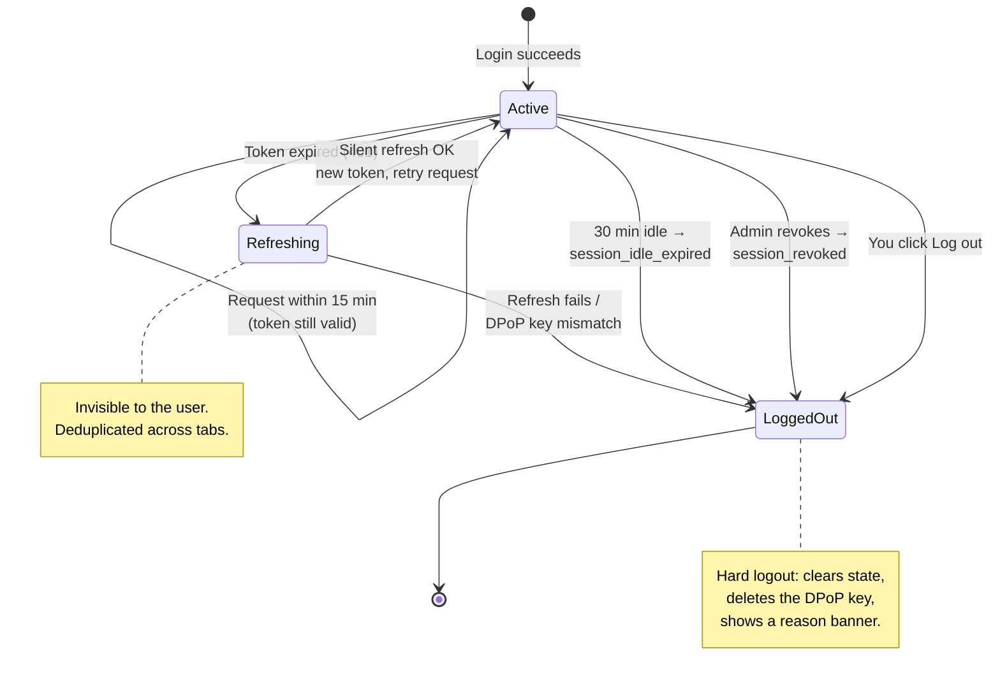

### 6.5 What AuthContext owns — and what it does not

A clean boundary worth stating plainly: the front-end's **AuthContext owns only the credential flow** — logging in, logging out, refreshing, and the lifecycle of the DPoP keypair. It deliberately does **not** decide who you are in terms of tenant, scope, or what data you may see. That entirely separate responsibility belongs to **Sentinel**, the subject of the next chapter. Keeping "are you authenticated?" separate from "what are you allowed to see?" is a structural decision that makes both easier to reason about and to secure.

---

<a id="ch7"></a>
## 7. Sentinel — The Heart of "Who Can See What"

> **In one breath.** Sentinel is the single most important security mechanism in Vector, and the idea behind it is beautifully simple. On every request, before any data is fetched, Sentinel works out a *clamp*: this person, in this tenant, in this workspace, allowed to see exactly this slice of the organisation's tree — and no more. That clamp is then stamped onto every database query automatically. The genius is the fail-safe: if anything about the clamp is uncertain or comes back empty, the system returns **nothing** rather than everything. A locked door that jams shut, never open. This is how Vector guarantees that one tenant can *never*, under any circumstance, see another tenant's data.

Imagine the whole organisation as a tree. At the top, the tenant. Below it, workspaces; below those, a hierarchy of departments, programmes, teams, projects — these are the **topology nodes**. Any given person has been *granted* access to some branch of that tree. Sentinel's job, on every request, is to compute precisely which nodes that person may touch right now, and to make every query obey that boundary.

### 7.1 Four clamps, stacked

"The clamp" is really four nested boundaries, each established from a trustworthy source and enforced on the server:

```
┌─────────────────────────────────────────────────────────────┐
│  TENANT CLAMP    — which subscription (organisation)?        │
│  ┌───────────────────────────────────────────────────────┐  │
│  │  WORKSPACE CLAMP  — which workspace within it?         │  │
│  │  ┌─────────────────────────────────────────────────┐  │  │
│  │  │  NODE CLAMP   — which branch of the tree?        │  │  │
│  │  │  ┌───────────────────────────────────────────┐  │  │  │
│  │  │  │  USER-RIGHTS CLAMP — which actions?        │  │  │  │
│  │  │  │  (role + permissions — see Ch.11)          │  │  │  │
│  │  │  └───────────────────────────────────────────┘  │  │  │
│  │  └─────────────────────────────────────────────────┘  │  │
│  └───────────────────────────────────────────────────────┘  │
└─────────────────────────────────────────────────────────────┘
        Each layer is established from the signed login token
        or a live database grant check — never from the browser.
```

- **Tenant clamp** — your `subscription_id`, carried in your signed access token. It cannot be forged. Every tenant-scoped query carries `WHERE ..._subscription = $1`, so you only ever query *within* your organisation.
- **Workspace clamp** — your `workspace_id`, also from the token, but additionally re-validated on every request against a live database check (`HasActiveRole`) that you still hold a grant there. If an admin revokes your workspace access, the very next request fails — the system doesn't wait for your token to expire.
- **Node clamp** — the branch of the topology tree you may see, computed fresh each request (described next).
- **User-rights clamp** — your role and permissions, deciding which *actions* you may take (covered in [Chapter 11](#ch11)).

The browser knows about these clamps too — it uses them to decide which scope picker to show and which buttons to grey out — but that is **display only**. The authoritative version is always the server's.

### 7.2 How the node clamp is computed

After login is verified, a Go middleware — `sentinel.Middleware` — runs on every data-bearing route (it always runs *after* authentication, so it can trust the identity). It does the following:

1. Reads the authenticated user from the request.
2. Resolves the **workspace**, and confirms via a live DB check that the user actually holds an active role there (this is the forgery guard — a tampered token claiming a workspace you have no grant on is rejected with a 403).
3. Resolves the **focus node** — the specific branch you're currently looking at. This comes from the URL hint, your saved default, or the workspace/tenant root, and every candidate is checked against your actual grants.
4. Walks the topology tree — a recursive database query — to compute **`AllowedSubtreeIDs`**: the complete set of node ids you are cleared to see, gathered upward (ancestors) and downward (descendants) from your focus. Crucially, that tree-walk is itself bounded by your `subscription_id` at *every step*, so it is structurally impossible for the walk to wander into another tenant's nodes.
5. Packs all of this into a **Clamp** and attaches it to the request:

```go
type Clamp struct {
    TenantID          uuid.UUID
    UserID            uuid.UUID
    Role              string
    RoleID            uuid.UUID
    WorkspaceID       uuid.UUID
    FocusNodeID       uuid.UUID
    ScopeUp           bool
    ScopeDown         bool
    AllowedSubtreeIDs []uuid.UUID
    SubtreeResolved   bool        // ← the fail-safe flag
}
```

### 7.3 The fail-closed filter — the most important code in Vector

Now the payoff. Whenever a query lists data, it asks Sentinel to splice the clamp into the SQL. That splicing is done by one small, exact function — `SubtreeClause` — and its behaviour is the bedrock of the whole security model. It has **four states**, and the conservative one is the default:

```go
func SubtreeClause(ctx context.Context, topologyColumn string, args []any, startIdx int)
        (fragment string, outArgs []any, nextIdx int) {
    c := sentinel.FromCtx(ctx)
    if !c.SubtreeResolved {
        return "", args, startIdx                       // (a) bypass — admin/dev path
    }
    if len(c.AllowedSubtreeIDs) == 0 {
        return " AND FALSE", args, startIdx             // (b) FAIL CLOSED — return NOTHING
    }
    outArgs = append(args, c.AllowedSubtreeIDs)
    return fmt.Sprintf(" AND %s = ANY($%d::uuid[])",    // (c) clamp to the allowed set
        topologyColumn, startIdx), outArgs, startIdx + 1
}
```

Read state **(b)** slowly, because it is the single most important line in the manual. If Sentinel *ran* but resolved your allowed set to **empty** — perhaps a misconfiguration, perhaps a grant that yielded nothing — the query does not quietly fall through to "show everything." It appends `AND FALSE`, which means the database returns **zero rows**. The door doesn't fail open; it fails *shut*.

The flag `SubtreeResolved` is what distinguishes a deliberate, audited admin bypass (state *a*) from a resolved-but-empty clamp (state *b*). It is set to `true` only on the success path, at the very last step, after a real subtree was computed. Every error path returns *before* that — so a half-failed resolution can never masquerade as a successful one.

State **(c)** is the everyday case: the query gains `AND <node column> = ANY($N::uuid[])`, where `$N` is your allowed set of node ids, passed safely as a parameter (never glued into the SQL text). A real listing query ends up looking like:

```sql
WHERE a.artefacts_id_subscription = $1          -- tenant clamp
  AND a.artefacts_archived_at IS NULL
  AND at.artefacts_types_scope = $2
  AND a.artefacts_id_topology_node = ANY($3::uuid[])   -- node clamp (the allowed set)
```

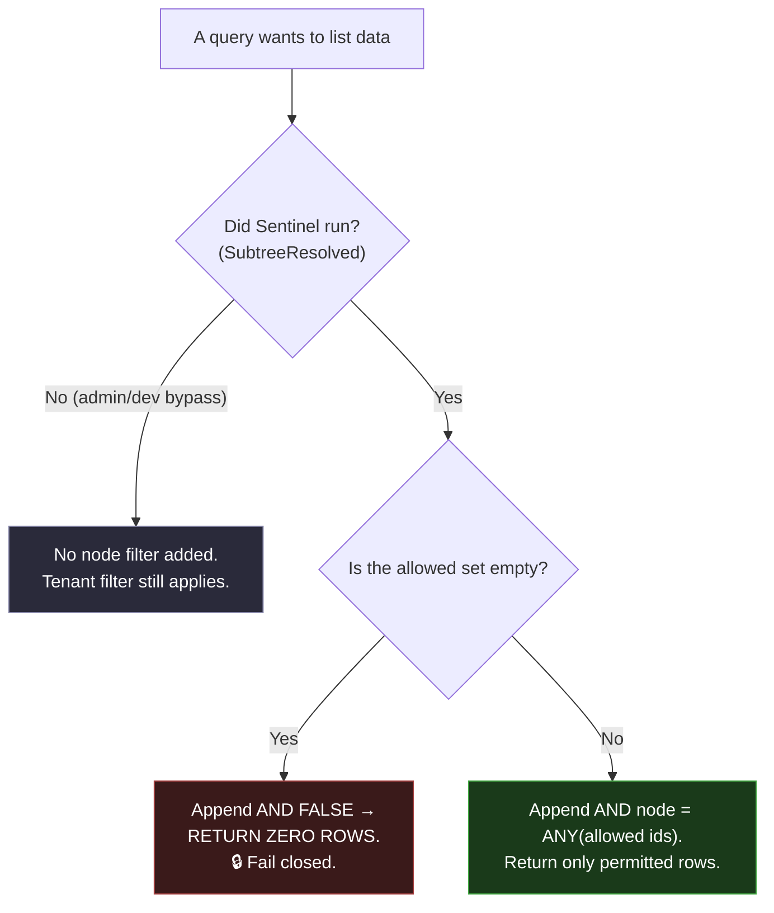

### 7.4 The `?meg=` hint — a narrower, never a wider

You will sometimes see a `?meg=` value in the URL. It is tempting to assume it *sets* your scope. It does not, and this distinction is a hard rule in Vector's own engineering guide. The `?meg=` value is a **narrowing hint** — it lets you sub-select *within* the boundary Sentinel already established. It can never expand it.

If a hostile client sends a `?meg=` pointing at a node *outside* your allowed set — say, a node belonging to another tenant — the server re-validates it (`CanReadScope`, a live grant-walk) and rejects it with a 403. And even if that check were somehow bypassed, the result is still intersected with `AllowedSubtreeIDs`, so the query can never touch a node outside your clamp. The hint is checked, then narrowed, then narrowed again. It is cosmetic transport, not authority.

### 7.5 How tenant A never sees tenant B's data — the whole guarantee

Putting it together as a plain-English chain of defences:

1. **Every request carries a signed token** with the tenant id inside it. The browser cannot alter it.
2. **Sentinel computes the clamp** from that trusted identity — and the tree-walk that finds your allowed nodes is bounded by your tenant id at every recursive step, so it physically cannot cross into another tenant.
3. **Every query carries the tenant filter** (`subscription = $1`) *and* the node filter (`= ANY(allowed)`). Tenant B's rows carry tenant B's subscription id, so they are excluded before the node filter even runs.
4. **If anything is empty or uncertain, the query returns nothing** — fail closed.
5. **`?meg=` can only narrow**, never widen, and is re-validated against live grants.
6. **Workspace access is re-checked live** on every request, so revoking access takes effect immediately, not at token expiry.

This is *defence in depth*: even if one layer had a flaw, the next would still hold the line. And it is enforced not by hoping developers remember it, but by an automated test (`sentinel_clamp_test.go`) that **fails the build** if any code reads artefact data without invoking the clamp. We'll meet that guard, and its siblings, in [Chapter 11](#ch11).

---

<a id="ch8"></a>
## 8. Navigation — How Your Two Rails Are Built

> **In one breath.** Down the left of every screen are two strips. The narrow one (rail 1) is a column of icons — each one a *section* of the app. Click a section and the wider strip beside it (rail 2) fills with that section's pages. The clever, security-relevant part: the server decides which sections and pages you're even *allowed* to know exist, and sends you only those. Pages your role can't access aren't merely hidden on your screen — they were never sent to your browser in the first place. You can also create your own custom sections ("buckets") and pin your favourite pages, and those preferences follow you around.

The navigation looks simple, but it is a small, complete example of every principle in this manual: server-authoritative filtering, per-tenant and per-user data, and clean separation of concerns.

### 8.1 The two rails

- **Rail 1** (the component `IconRail`, in `app/redesign/`) is the narrow icon column. It renders one button per **section**. A section is a *bucket* — either a built-in category (like "Personal" or "Planning") or a custom group you created. Clicking a section activates it and jumps you to its first page.
- **Rail 2** (the component `SectionFlyout`) is the wider panel that slides out beside rail 1. It shows the **pages of the currently active section**, including nested sub-pages, plus your bookmarks. It can be pinned open or set to appear on hover.

```
   RAIL 1            RAIL 2 (active section's pages)
 ┌────────┐   ┌──────────────────────────────┐
 │  [🏠]   │   │  ▸ Dashboard                 │
 │  [📋]◀──┼───┤  ▸ Work Items                │
 │  [📊]   │   │     • Backlog                │   ← clicking the
 │  [⚙️]   │   │     • Board                  │     section icon in
 │  [👤]   │   │  ▸ Sprints                   │     rail 1 fills
 │  ───    │   │  ─────────────               │     rail 2 with its
 │  [🔔]   │   │  ★ Bookmarks                 │     pages
 │  [↩]    │   │     • (your pinned pages)    │
 └────────┘   └──────────────────────────────┘
   icons         the active section's pages
```

### 8.2 What "buckets" are

A **bucket** is a named grouping that appears as a section. There are two kinds:

- **Tag buckets** — fixed, product-defined categories (e.g. Personal, Planning, Workspace Admin). They organise the built-in pages.
- **Custom groups** — buckets *you* create and name (up to ten), stored in the `users_nav_groups` table. You can drop pages into them and reorder them.

On top of buckets, you can **pin** your favourite pages (capped — the server enforces a maximum, currently 100, in the `MaxPinned` constant) and keep separate named **profiles** of nav layouts. All of these preferences are stored per-user and per-tenant, so your navigation is genuinely *yours* and switches correctly when you move between workspaces.

### 8.3 The server decides what you may see — the security part

This is the chapter's crucial point, and it comes from a real lesson. There was once a lapse (recorded internally as *TD-NAV-AUTH-TIER*, 19 May 2026) where an admin-only section was hidden by a *client-side* check only — the screen tidied it away, but the underlying data wasn't truly gated. That was treated as a security defect, not a cosmetic one, and the fix established the rule now enforced everywhere:

> **The backend filters navigation by your role *before* sending it. The client filter is only defence-in-depth.**

When your browser asks for the navigation catalogue (`GET /_site/nav/catalogue`), the Go handler runs your role and tenant through `CatalogFor` and `TagsFor`, which drop every page and every bucket you have no grant for *before the response is built*:

```go
func (r *Registry) CatalogFor(roleID uuid.UUID, subscriptionID uuid.UUID) []CatalogEntry {
    out := make([]CatalogEntry, 0, len(r.entries))
    for _, e := range r.entries {
        if !roleAllowed(roleID, e.RoleIDs) {
            continue                              // ← page you can't see is dropped here
        }
        if e.SubscriptionID != nil && *e.SubscriptionID != subscriptionID {
            continue                              // ← other tenants' entity pages dropped
        }
        out = append(out, e)
    }
    return out
}
```

The consequence is decisive: a page your role isn't granted is **never in the payload**. The browser cannot reveal what it never received. And a second gate guards the write side — if a tampered client tries to *pin* a page it was never granted, the server's `validatePinned` rejects it. The page-access grants come from the `users_roles_pages` matrix, authored in one admin screen, used both for the rails and for direct-URL page access.

### 8.4 What's whose — the scope of each nav piece

| Nav piece | Scope |
|---|---|
| Tag buckets, system pages | Global, filtered by your role |
| Entity pages | Per-tenant (only your subscription's) |
| Custom pages (`/p/...`) | Per-user — only their creator sees them |
| Custom groups (buckets) | Per-user |
| Pinned pages, bookmarks, profiles | Per-user, per-tenant, per-profile |

Navigation does *not* change with your focus node (`?meg=`) — that hint scopes your *data lists*, not which pages exist. When you switch workspace, your token is re-minted and the whole nav set reloads for the new tenant.

### 8.5 From login to rendered rails

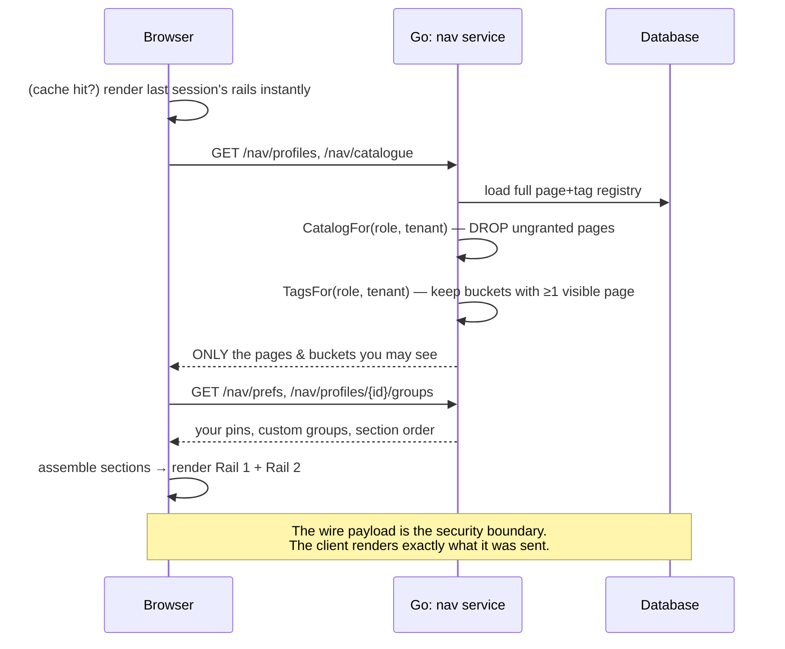

To avoid a blank flash on load, the browser keeps a local cache of last session's nav and renders it instantly, then quietly refreshes from the server in the background.

---

<a id="ch9"></a>
## 9. The Life of a Click — One Action, End to End

> **In one breath.** Let's follow one ordinary action — loading your list of work items — every step of the way, so you can see all the parts cooperating. Your click triggers a small, well-organised relay: a screen component asks a data helper, the helper sends a request to the gate, the gate hands it to a *handler*, the handler passes it to a *service* that applies the rules and the Sentinel clamp, the service runs a safe parameterised query against the database, the rows come back, get reshaped into a tidy package, and travel home to fill your grid. Each part has exactly one job. That discipline is what keeps a large system understandable — and secure.

The Go back end uses a strict four-layer pattern for every feature. Using work-items (`backend/internal/artefactitems/`) as the example:

| Layer | File | Its single responsibility |
|---|---|---|
| **Handler** | `handler.go` | Speak HTTP. Parse the request, read identity from the token, map errors to status codes. Touches no database. |
| **Service** | `service.go` | The brains. Apply business rules, the Sentinel clamp, assemble the query safely, manage transactions. |
| **SQL** | `sql.go` | Hold the query *templates* as constants. No user input is ever glued in. |
| **Types** | `types.go` | Define the tidy data shapes (DTOs) sent over the wire, and the named error values. |

This separation is enforced, not merely encouraged: a lint rule (`lint:no-db-in-handlers`) **fails the build** if a handler tries to touch the database directly. A handler physically cannot skip the service layer and its tenant-filter discipline.

### 9.1 The journey, hop by hop

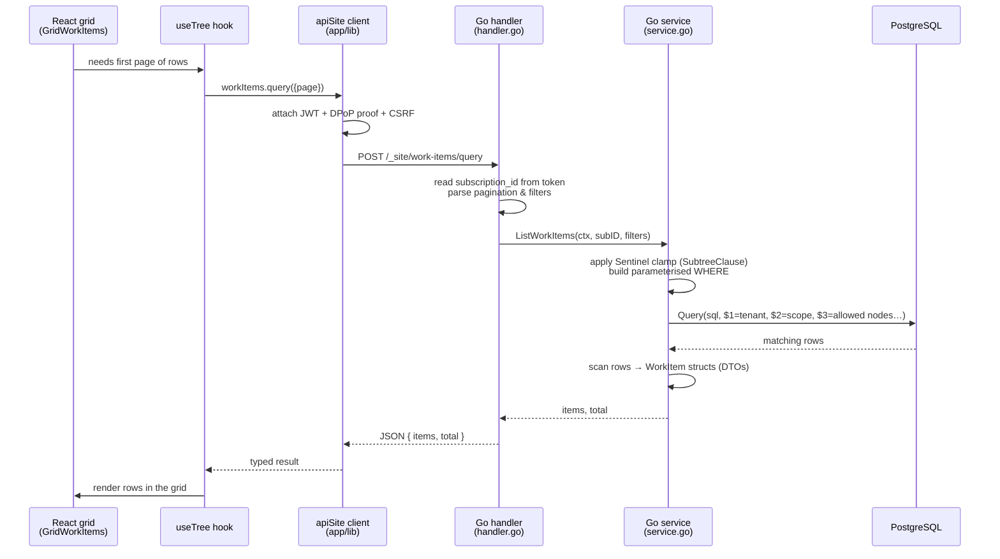

**On the front end**, the grid component (`GridWorkItems.tsx`) doesn't call the network directly. It uses a hook (`useTree`) that manages paging and row-expansion, which calls a data function, which calls `workItems.query()` from the API client. That client (`app/lib/api.ts` / `apiSite/index.ts`) is the one place that attaches the security headers — the JWT, the freshly-signed DPoP proof, the CSRF token — and handles the silent-refresh-and-retry from [Chapter 6](#ch6). It even *coalesces* duplicate in-flight requests: if two panels ask for the same data at once, only one network call is made.

**On the back end**, the handler reads your tenant id from the *token* (never the URL), parses the pagination and filter parameters, and calls the service. The service builds the query by appending parameterised clauses — the Sentinel clamp first, then any filters you chose — into a list of `$N` placeholders, and runs it:

```go
rows, err := s.vectorArtefactsPool.Query(ctx, dataQ, dataArgs...)
```

Every value travels in `dataArgs` as a typed parameter. The SQL text itself never contains a scrap of user input. This is the line that closes off SQL injection for the entire feature.

The rows are scanned into clean `WorkItem` structures and returned as JSON. Back in the browser, the result is reshaped to the grid's row format and rendered. One click; a dozen cooperating parts; each doing one job.

### 9.2 The "index" / barrel pattern — clean front doors

You asked about "our index.tsx system." Throughout the front end, folders expose a single front door called `index.ts` (or `index.tsx`). This is the **barrel** pattern. A folder's `index.ts` re-exports the public pieces of that folder, so callers write a clean import against the *folder* rather than reaching into deep internal file paths:

```javascript
// Clean — imports from the folder's front door:
import { workItems } from "@/app/lib/apiSite";

// Instead of the brittle deep path:
import { workItems } from "@/app/lib/apiSite/index.ts";
```

The benefits are real: the internal file layout can be reorganised without touching every call site; internal helpers stay private (only what the barrel exports is public); and each `index.ts` becomes a readable catalogue of what a module offers. In Vector, `app/lib/apiSite/index.ts` is exactly this — the typed master registry of every data operation (`workItems`, `auth`, `nav`, `topology`, `sprints`, and so on), each a small bag of methods that call the gate.

---

<a id="ch10"></a>
## 10. Live Updates — REST, WebSockets, and the Outbox

> **In one breath.** Most of Vector works on a simple request-and-reply rhythm: the browser asks, the server answers (this is called REST). But two things need to feel *live*. When someone reorders a list, everyone watching should see it move — that uses a always-open two-way connection called a **WebSocket**. When you receive a notification, a little bell should light up — that uses a one-way live stream called **SSE**. Both of these are deliberately *minimal*: they don't send the actual data, they just whisper "something changed, go refresh." Separately, a background worker quietly keeps the search index up to date using a reliable trick called the **outbox pattern**, so search never blocks the thing you're actually doing.

### 10.1 The default rhythm — REST

The overwhelming majority of Vector is **REST**: a request goes out, a reply comes back, the connection closes. Loading work items, saving an edit, fetching navigation, switching workspace — all request-and-reply. It's simple, cacheable, easy to secure (every request runs the full middleware gate), and easy to reason about. REST is the default for a reason.

### 10.2 Live reordering — the WebSocket

Some things benefit from being *pushed* rather than polled. The headline example is **rank changes** — when one person drags a work item to a new position, everyone else viewing that list should see it slide into place without refreshing.

For this, the browser opens a **WebSocket** — a persistent, two-way connection — to the gate's `/ws` endpoint and subscribes to a topic. On the server side, there's an elegant bridge to the database itself. PostgreSQL can emit a tiny notification when a row changes, via its `LISTEN`/`NOTIFY` feature. A trigger on the data fires `pg_notify('rank_changed', …)`; a Go listener goroutine is permanently waiting on `LISTEN rank_changed`, and when it hears one, it republishes it to every subscribed browser:

```go
if _, err := conn.Exec(ctx, "LISTEN rank_changed"); err != nil { return err }
for {
    n, _ := conn.Conn().WaitForNotification(ctx)
    var p rankPayload
    json.Unmarshal([]byte(n.Payload), &p)
    topic := TopicForRank(p.ResourceType, p.SubscriptionID, p.Scope, p.ScopeID)
    hub.Publish(topic, []byte(n.Payload))     // → all subscribed browsers
}
```

Crucially, the message is a **nudge, not a payload**. It carries only "this list changed" — the browser responds by re-fetching the list (debounced, to absorb bursts) via ordinary REST, which re-runs the full security gate. So the live channel never becomes a way to bypass authorisation; the actual data always comes back through the front door.

### 10.3 Live notifications — SSE

Notifications (the bell) use **Server-Sent Events (SSE)** — a one-way live stream from server to browser, simpler than a WebSocket because nothing flows back. The browser opens an `EventSource` to `/_site/notifications/stream`. When something is addressed to you, the server pushes a tiny event — again just a *nudge* (`{ type: "notification.created", kind }`) — and the browser refetches the full notification list over REST.

| Channel | Transport | Carries | Direction |
|---|---|---|---|
| Everything (CRUD) | **REST** | Full data, request/reply | Browser ⇄ Server |
| Rank/reorder | **WebSocket** (`/ws`) | A nudge to refetch | Server → Browsers (2-way socket) |
| Notifications | **SSE** (`/notifications/stream`) | A nudge to refetch | Server → Browser (1-way) |

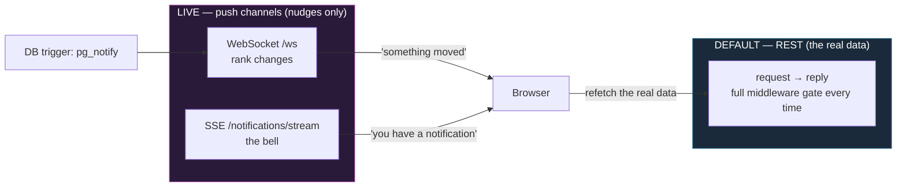

### 10.4 The outbox pattern — reliable background work

Vector offers full-text *and* AI-semantic search over your items. Computing those indexes is slow-ish (it even calls a local AI model to produce a vector "meaning" embedding), and you should never have to wait for it when you save an edit. The solution is the **transactional outbox pattern**, a well-known reliable-messaging technique.

When you create or change an item's title or description, a database trigger writes a little "to-do" row into an `artefacts_search_outbox` table — *in the very same transaction* as your edit. This is the magic: either both the edit and the to-do are saved, or neither is. There is no window where your edit succeeds but the index-update is lost.

A background worker (`searchworker`) waits for these to-do rows (woken instantly by a `pg_notify`, with a slow poll as backstop), claims one safely (using `FOR UPDATE SKIP LOCKED` so multiple workers never collide), recomputes the text search vector and the AI embedding, writes them back to the item, and deletes the to-do. If the AI step fails (say, on a machine with no model running), the to-do's attempt counter ticks up and it's simply retried later. Your save was never blocked; the index catches up on its own.

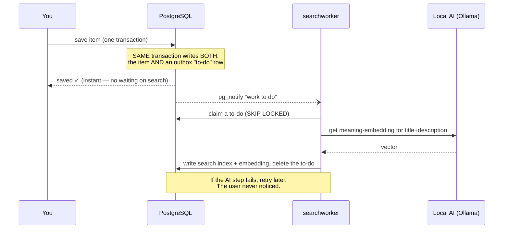

This same outbox shape underpins other "eventually-consistent" features (notifications, dependency projections). It is Vector's standard answer to "do reliable work later, without making the user wait."

---

<a id="ch11"></a>
## 11. Security — The Layers an Attacker Must Defeat

> **In one breath.** Vector's security is not one wall but many, stacked — *defence in depth*. To reach a single row of data they shouldn't, an attacker would have to defeat the network boundary, then the browser's strict script rules, then the cross-site-request guard, then login-plus-the-unstealable-key, then the Sentinel tenant clamp, then the per-action permission check, then parameterised queries that make injection impossible — and every step they tried would be written, permanently, into an audit log. No single trick gets through, because no single layer is trusted to be the only one.

This chapter gathers the defences, network-outward to data-inward. Several were introduced earlier; here they line up as a wall.

### 11.1 The layers

```
ATTACKER
   │
   ▼  Layer 1 — NETWORK
┌──────────────────────────────────────────────────────────────┐
│ PostgreSQL is never exposed to the internet. Access only via  │
│ an authenticated SSH tunnel. The vault has no public door.    │
└──────────────────────────────────────────────────────────────┘
   │
   ▼  Layer 2 — TRANSPORT HEADERS
┌──────────────────────────────────────────────────────────────┐
│ HSTS (force HTTPS, 1 year). nosniff. Frame protection.        │
│ Referrer & Permissions policy lockdown. On every response.    │
└──────────────────────────────────────────────────────────────┘
   │
   ▼  Layer 3 — CONTENT SECURITY POLICY (enforced)
┌──────────────────────────────────────────────────────────────┐
│ Per-request nonce. No inline scripts run without it. No       │
│ unsafe-inline in production. base-uri 'none', object-src      │
│ 'none'. Injected scripts simply do not execute.               │
└──────────────────────────────────────────────────────────────┘
   │
   ▼  Layer 4 — AUTHENTICATION + DPoP
┌──────────────────────────────────────────────────────────────┐
│ bcrypt passwords. 15-min JWT. 7-day refresh (hashed, HttpOnly)│
│ Every request needs a fresh proof from the non-extractable    │
│ key. MFA (TOTP). Lockout after 5 fails. Idle eviction.        │
└──────────────────────────────────────────────────────────────┘
   │
   ▼  Layer 5 — CSRF
┌──────────────────────────────────────────────────────────────┐
│ Double-submit token on every state-changing request,          │
│ compared in constant time. SameSite=Strict cookies.           │
└──────────────────────────────────────────────────────────────┘
   │
   ▼  Layer 6 — SENTINEL CLAMP
┌──────────────────────────────────────────────────────────────┐
│ Tenant + workspace + node boundary on every query.            │
│ Fail-closed (empty = AND FALSE = nothing). Build-enforced.    │
└──────────────────────────────────────────────────────────────┘
   │
   ▼  Layer 7 — RBAC (permissions)
┌──────────────────────────────────────────────────────────────┐
│ Per-action permission checks server-side. Role↔permission     │
│ catalogue verified at startup. Sole-writer tables.            │
└──────────────────────────────────────────────────────────────┘
   │
   ▼  Layer 8 — PARAMETERISED SQL
┌──────────────────────────────────────────────────────────────┐
│ No user input ever glued into SQL. Injection structurally     │
│ impossible. Handlers can't even touch the DB (lint-enforced). │
└──────────────────────────────────────────────────────────────┘
   │
   ▼  Layer 9 — AUDIT TRAIL
┌──────────────────────────────────────────────────────────────┐
│ Append-only record of logins, failures, permission changes,   │
│ key-binding violations. Every attempt above is written here.  │
└──────────────────────────────────────────────────────────────┘
   ▼
 DATA (only what you're cleared for)
```

### 11.2 Transport headers and the Content-Security-Policy

Every response from the Go gate carries hardening headers — `X-Content-Type-Options: nosniff` (stops the browser guessing file types into an attack), `X-Frame-Options` and `frame-ancestors` (stops your app being framed for clickjacking), a strict `Referrer-Policy`, and a locked-down `Permissions-Policy` that switches off camera, microphone, and geolocation. In production, **HSTS** forces HTTPS for a full year.

The page itself is protected by the **Content-Security-Policy** introduced in [Chapter 4](#ch4). It's worth stressing that this is now in **enforcing** mode (it graduated from a monitoring-only "Report-Only" soak on 18 May 2026, after the soak recorded zero violations). In production the policy permits **no inline scripts** without the per-request nonce, forbids `unsafe-inline`, sets `base-uri 'none'` and `object-src 'none'`, and reports any violation back to the server. The practical effect: even if an attacker found a way to inject a `<script>`, the browser refuses to run it.

A note on **Subresource Integrity (SRI)**: Vector does *not* currently pin script hashes with `integrity=` attributes; the nonce-based CSP is the chosen primary defence for script execution, with the trade-off recorded as a tracked item. (Honesty about what *isn't* yet done is itself part of the security discipline — see [Chapter 12](#ch12) on the tech-debt register.)

### 11.3 CSRF — the cross-site request guard

A **CSRF** (Cross-Site Request Forgery) attack tricks your logged-in browser into making a request you didn't intend. Vector blocks it with the standard **double-submit cookie**: a random token is set as a (deliberately readable) cookie, and the front end echoes it back in an `X-CSRF-Token` header on every state-changing request. The server compares the two using a constant-time comparison (which doesn't leak timing information) and rejects any mismatch. Safe, read-only methods are exempt; a small set of pre-login endpoints and API-key callers are handled separately because the cookie mechanism doesn't structurally apply to them.

### 11.4 RBAC — permission per action

Beyond *what data* you can see (Sentinel) sits *what actions* you may take (**RBAC** — Role-Based Access Control). Roles map to permissions through the `users_roles_permissions` tables. On the server, a `RequirePermission` guard checks your effective permission set before a protected action runs:

```go
for _, code := range codes {
    if _, ok := set[code]; !ok {
        httperr.Write(w, r, http.StatusForbidden, /* forbidden */)
        return
    }
}
next.ServeHTTP(w, r)
```

The catalogue of permission codes is verified against the database **at startup** — if the code and the database disagree, the server refuses to boot rather than run with an ambiguous permission model. On the front end, `sentinel_can('some.permission')` greys out buttons you can't use — but that is, once more, *cosmetic*. The server is the gate.

### 11.5 The automated guards — security you can't forget to apply

One of Vector's most distinctive choices is that many security invariants are enforced by **automated checks that fail the build** — so a developer literally cannot merge code that breaks them. A selection:

| Guard | What it prevents |
|---|---|
| `sentinel_clamp_test.go` | Any code reading artefact data **without** the Sentinel clamp — the headline tenant-isolation guard. |
| `lint:no-db-in-handlers` | A handler touching the database directly, bypassing the service layer's tenant filters. |
| `lint:writer-boundary` | Any package writing to the roles/permissions tables except the one sole-writer service. |
| `lint:public-dto-mapper` | Internal data shapes leaking onto the public API surface (e.g. a password hash slipping into a response). |
| `lint:scope-literals` | Hard-coding the `work`/`strategy` scope into SQL instead of parameterising it. |
| `lint:role-literals` | Comparing against role *names* in the UI instead of checking *permissions* (so a rename can't silently open a gate). |
| `lint:no-direct-workspace-id` | Reading workspace identity outside Sentinel, risking a stale-identity leak. |

This is the deepest expression of "the server is the gate, and we don't trust ourselves to remember it." The rules are mechanical, in CI, and unbypassable.

### 11.6 Secrets, rate limits, lockout, and the audit trail

**Secrets** (database passwords, the JWT signing key) are stored encrypted at rest as `ENC[…]` blobs and decrypted at startup with **AES-256-GCM** using a master key from the environment; a bad secret crashes the server immediately rather than running misconfigured. (A sweep to route the last few raw reads through this wrapper is tracked in the debt register.)

**Rate limits** throttle abuse: login is capped per IP (brute-force defence), password-reset is tightly capped, and authenticated users have a per-user write cap (≈60/minute) that blunts a botnet acting as one account. **Account lockout** kicks in after five failed logins (a 15-minute freeze in production). The trusted-IP model refuses to believe a forged `X-Forwarded-For` header unless it comes from an allow-listed source.

**The audit trail** is an append-only `audit_log`: logins and failures, MFA events, account lockouts, password changes, permission changes, refresh-token reuse, and DPoP key-binding violations are all written with the actor, tenant, IP, and which transport lane they came through. High-severity events can fan out to an alerting webhook. It is the permanent record that turns "did someone try X?" into a query, not a guess — exactly what a SOC 2 / defence / finance auditor expects to see.

**Input handling** closes the loop: every query is parameterised (injection-proof), and any user-supplied HTML is scrubbed twice — once on the server at write time (a strict tag allowlist), once in the browser at render time (`DOMPurify`) — with the CSP as a third backstop.

---

<a id="ch12"></a>
## 12. Why We Built It This Way — The Decisions Behind the Design

> **In one breath.** Every big choice in Vector traces back to one belief: this is a real business serving security-conscious buyers, so the *right* foundation beats the *fast* shortcut every time. Go over a flashier back-end language because it's simple and hard to get wrong. Two databases because a read-only library spine shouldn't be writable. Short tokens plus an unstealable key because stolen credentials are the most common breach. A single Sentinel clamp because tenant isolation is too important to scatter across a hundred handlers. And automated guards because humans forget — machines don't. The throughline is *foundation over patch*.

Here are the pivotal choices, each as a "we chose X over Y, because…".

**Go for the back end, over Node.js or Python.** The gate makes every security decision, so it needs to be fast, predictable, and hard to write subtle bugs in. Go compiles to a single quick binary, has no surprising runtime, forces explicit error handling, and has a small surface where mistakes can hide. For a security-critical gate, "boring and rigorous" beats "expressive and clever."

**PostgreSQL, over a NoSQL store.** Tenant data is deeply relational — users belong to workspaces belong to a topology tree, items reference types and flows and owners. A relational database with real foreign keys, transactions, and mature tooling is the natural fit. Postgres also brought two bonuses Vector leans on: `LISTEN/NOTIFY` for live updates, and `pgvector` for AI-semantic search — both used rather than bolted on.

**Two databases, over one.** The `mmff_library` catalogue is content MMFF publishes for tenants to consume but never alter. Making it a *physically separate, read-only* database means tenant code is *structurally incapable* of corrupting the shared spine — a guarantee no amount of careful coding in a single database could match.

**Short-lived tokens + DPoP, over a long-lived session cookie.** The most common real-world breach is a stolen credential. A 15-minute token limits the blast radius of a leak; binding every request to a non-extractable browser key means a stolen token is *useless* without the key. This is precisely the control defence and finance buyers ask for, and it's why the auth chapter is the longest in the manual.

**Next.js + React, over a hand-rolled front end.** A rich, interactive product (drag-and-drop, live grids, diagram canvases) needs a mature UI framework. Next.js additionally gives a per-request server layer (the edge middleware) that became the home for the CSP nonce — a security control that would be awkward to place anywhere else.

**One Sentinel clamp, over per-handler scoping.** Tenant isolation is too important to re-implement (and risk getting subtly wrong) in every one of dozens of handlers. Centralising it in a single middleware + a single fail-closed SQL helper means the rule is written *once*, audited *once*, and — via the build-failing test — *cannot be forgotten*. The May 2026 nav lapse and the focus-scope bug both taught the same lesson: scatter a security rule and you will eventually miss a spot.

**Server-authoritative everything, over trusting the client.** Stated and re-stated because it is the spine: the browser is for convenience and presentation; the server decides. Hidden buttons are tidiness, not security. The wire payload itself must never contain what the caller isn't cleared for.

**Automated guards, over developer discipline alone.** People forget; CI doesn't. Encoding invariants as lint rules and tests that fail the build converts "please remember to add the clamp" into "you cannot merge without it." This is the most mature expression of the security posture — and it's why a fresh engineer (or a future session with no memory of these conversations) can't accidentally regress a core protection.

**And the meta-decision: foundation over patch.** Vector is a live business with security-conscious buyers and no artificial deadline pressure to cut corners. The standing engineering rule is that "works for now" is not "done"; that any shortcut must be written into a *tech-debt register* with a trigger and a payment plan; and that a hack disguised as a fix is forbidden. That discipline is *why* this manual could be written as a confident source of truth: the system was built to be understood, defended, and built upon — not merely to pass a demo.

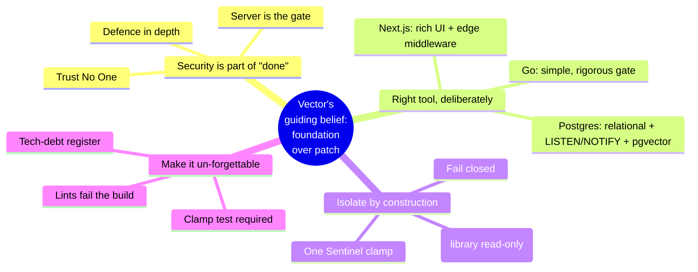

---

<a id="index"></a>
## 13. Glossary / Index — Every Term in Plain English

*Jump back to the [Table of Contents](#toc).*

- **Access token** — A short-lived (15-minute) signed ticket proving who you are right now. See [Ch. 5](#ch5).
- **App Router** — Next.js's modern way of organising pages (the `app/` folder). See [Ch. 2](#ch2).
- **Audit log** — An append-only, permanent record of security-relevant events. See [Ch. 11](#ch11).
- **Barrel (`index.ts`)** — A folder's single clean "front door" that re-exports its public pieces. See [Ch. 9](#ch9).
- **bcrypt** — A deliberately slow, salted password-scrambling method; the server stores only this, never your real password. See [Ch. 5](#ch5).
- **Bucket** — A named navigation grouping (a built-in tag category, or a custom group you create). See [Ch. 8](#ch8).
- **chi** — The lightweight web router the Go back end uses. See [Ch. 2](#ch2).
- **Clamp** — Sentinel's per-request boundary: tenant + workspace + node + rights. See [Ch. 7](#ch7).
- **CORS** — Rules about which web origins may call the gate. See [Ch. 3](#ch3).
- **CSP (Content-Security-Policy)** — Browser rules that refuse to run any script without the page's per-request nonce. See [Ch. 4](#ch4), [Ch. 11](#ch11).
- **CSRF** — An attack that abuses your logged-in browser; blocked by the double-submit token. See [Ch. 11](#ch11).
- **Docker / Swarm** — Sealed, portable containers (and their orchestration) that run the database and cache identically everywhere. See [Ch. 2](#ch2).
- **DOMPurify** — A library that scrubs user-supplied HTML clean of attacks before display. See [Ch. 11](#ch11).
- **DPoP** — *Demonstrating Proof-of-Possession*; every request is signed by an unstealable browser key, so a stolen token is useless. See [Ch. 4](#ch4), [Ch. 5](#ch5).
- **DTO** — *Data Transfer Object*; the tidy data shape sent over the wire. See [Ch. 9](#ch9).
- **Fail closed** — When uncertain, return *nothing* rather than everything. The Sentinel default. See [Ch. 7](#ch7).
- **Go (Golang)** — The fast, simple, safe language of the back-end gate. See [Ch. 2](#ch2).
- **Handler / Service / SQL / Types** — The four-layer pattern of every Go feature. See [Ch. 9](#ch9).
- **HSTS** — A header that forces browsers to use HTTPS. See [Ch. 11](#ch11).
- **IndexedDB** — The browser's private storage where the non-extractable DPoP key lives. See [Ch. 4](#ch4).
- **JWT** — *JSON Web Token*; a small signed packet of facts about you (the access token). See [Ch. 5](#ch5).
- **Lint rule** — An automated code check that fails the build if a rule is broken. See [Ch. 11](#ch11).
- **LISTEN/NOTIFY** — PostgreSQL's built-in "something changed" signal, bridged to live WebSocket updates. See [Ch. 10](#ch10).
- **MFA / TOTP** — Multi-factor authentication via rotating six-digit authenticator codes. See [Ch. 5](#ch5).
- **Middleware** — A chain of small gatekeepers every request passes through. See [Ch. 3](#ch3), [Ch. 9](#ch9).
- **`?meg=`** — A *narrowing hint* in the URL that can sub-select within your clamp, never widen it. See [Ch. 7](#ch7).
- **Multi-tenant** — Many organisations on one running system, fully walled off from each other. See [Ch. 1](#ch1).
- **Next.js** — The React framework powering the screens. See [Ch. 2](#ch2).
- **Nonce** — A single-use random value; here, the per-request password that lets a script run under the CSP. See [Ch. 4](#ch4).
- **Outbox pattern** — Writing a reliable "to-do" row in the same transaction as a change, drained by a background worker. See [Ch. 10](#ch10).
- **Parameterised query** — User input passed as safe parameters (`$1`, `$2`), never glued into SQL — closes off injection. See [Ch. 9](#ch9).
- **pgx / pgxpool** — The high-performance driver and connection pool Go uses for Postgres. See [Ch. 2](#ch2), [Ch. 3](#ch3).
- **PostgreSQL** — The relational database holding all data. See [Ch. 2](#ch2).
- **Rail 1 / Rail 2** — The icon column and the page panel of the navigation. See [Ch. 8](#ch8).
- **RBAC** — *Role-Based Access Control*; which *actions* your role permits. See [Ch. 11](#ch11).
- **Refresh token** — A long-lived (7-day) random credential in an unreadable cookie, used to silently get new access tokens. See [Ch. 5](#ch5), [Ch. 6](#ch6).
- **REST** — The default request-and-reply rhythm of the app. See [Ch. 10](#ch10).
- **Sentinel** — The system that resolves *who you are / which tenant / which branch* and clamps every query. See [Ch. 7](#ch7).
- **Silent refresh** — Invisibly swapping an expired access token for a fresh one and retrying. See [Ch. 6](#ch6).
- **SSE (Server-Sent Events)** — A one-way live stream from server to browser, used for the notification bell. See [Ch. 10](#ch10).
- **SubtreeClause** — The small fail-closed SQL helper at the heart of tenant isolation. See [Ch. 7](#ch7).
- **Subscription / Tenant** — One customer organisation. See [Ch. 1](#ch1).
- **Topology node** — A point in the organisation's tree (department, programme, team, project). See [Ch. 1](#ch1), [Ch. 7](#ch7).
- **Tech-debt register** — The honest, tracked list of deferred work, each with a trigger and a plan. See [Ch. 12](#ch12).
- **Valkey** — The fast in-memory cache (Redis-compatible). See [Ch. 2](#ch2).
- **WebSocket** — A persistent two-way connection used for live reorder updates. See [Ch. 10](#ch10).
- **Workspace** — A division within a tenant; your access is re-checked here on every request. See [Ch. 7](#ch7).

---

*End of manual. Built as a golden-state source of truth, verified against the Vector codebase on 6 June 2026.*

