# Database Mapping — Relational Data-Flow Index

> **Date:** 2026-04-25
> **Sources:** `db/schema/001…030_*.sql` (mmff_vector, primary DB), `db/library_schema/001…008_*.sql` (mmff_library, content DB), `db/seed/001_default_workspace.sql`, and `docs/c_schema.md` (the live-snapshot golden source).
> **Purpose:** end-to-end map of every relational pathway in the system — table list, foreign-key chains, polymorphic dispatch, cross-DB references, and plain-English flow narratives. Read this when you need to know "how does X reach a user?" without re-reading every migration.

> **Scope note.** This is a project written in Go + Next.js with hand-written SQL migrations. There is **no ORM** (no Prisma / TypeORM / Sequelize / ActiveRecord) — the schema is the SQL files in `db/schema/`. Go structs in `backend/internal/models/models.go` mirror the tables 1:1 but do not emit DDL. There is no `schema.rb` or `schema.sql` consolidated dump. The "schema" *is* the numbered migration directory.

---

## 0. Decision-relevant facts (read this first)

These are the decisions the rest of the document depends on. Skim them before drawing any conclusion from the tables below.

- **Theme persistence is client-side.** No DB table backs the Theme page. `pages` row exists for the Theme route (mig 014) but values are stored in localStorage. If you need server-side theme persistence (cross-device sync, gadmin enforced theme), it does not exist and would require a new table. Flagged in §4.7.
- **`item_state_history.item_id` has no real FK.** The work-item domain (`task`, `user_story`, `feature` …) is not built. The mig-013 dispatch trigger explicitly skips this table. Reads must tolerate dangling `item_id`s; writes must be confined to an `entityrefs`-style writer service when the item tables ship.
- **Authorisation is hard-coded, not catalogued.** The 3-value `user_role` enum (`user`/`padmin`/`gadmin`) is the **entire** role system. There is no `roles` table, no `permissions` table, no `role_permissions` join. The role *is* the permission. Page-level allow-list (`page_roles`) and per-row workspace ACL (`user_workspace_permissions`) are the two refinement layers. See §4.6.
- **The schema is the migration directory.** No ORM, no consolidated `schema.sql`, no `schema.rb`. The Go structs in `backend/internal/models/models.go` mirror tables 1:1 but do not emit DDL. To know what's true, read the numbered SQL files.
- **Migration 027 is missing on disk** (numbering jumps 026 → 028). Intentional, tracked as TD-DB-018; doesn't affect the relational map.
- **`audit_log` is append-only by convention only.** No trigger; writers simply never UPDATE/DELETE. Compare `item_state_history` and `error_events`, which are trigger-enforced (`db/schema/006_states.sql:150`). See §4.5.

---

## 0.1 Polymorphic FK strategy: application-enforced vs. formal constraints

The schema uses **application-enforced foreign keys** for polymorphic relationships (where a column can reference multiple parent tables). This is a deliberate design choice, not a gap.

**Examples:**
- `pages.key_enum = 'custom:<uuid>'` → `user_custom_pages.id`: The UUID is opaque to the `pages` table; the app parses the enum prefix and dispatches the lookup. A formal FK would require materializing the `user_custom_pages` record as a pages column (creating redundancy) or adding a dispatch-kind column to `pages` (denormalization).
- `audit_log.(resource, resource_id)`: Fully polymorphic — the app alone knows whether it references a subscription, a user, an item, etc. A formal FK would require a `resource_kind` discriminator column, adding complexity for a read-only audit table.
- `entity_stakeholders` and `item_state_history`: Both use `entity_kind` / `item_type_kind` dispatch columns *and* mig-013 triggers to enforce the polymorphism. These are **hybrid**: DB-level dispatch validation + app-level parent existence checks (since the parent tables don't all exist yet).

**Decision rationale:**
1. Simpler schema without dispatch columns on every polymorphic table.
2. Dispatch logic lives in one place (the writer service / `entityrefs` module), not scattered across FK constraints.
3. Audit and event tables benefit from append-only semantics without fk-cascading side effects.
4. The trade-off: **all polymorphic writes must go through an application layer that validates parent existence**. Direct SQL inserts bypass this guarantee.

**When to formalize:** If a polymorphic relationship becomes a performance bottleneck (expensive app-layer lookups on every write) or a data-integrity risk (writers aren't consistently enforcing parent checks), add a dispatch column + CHECK constraint + formal FK. Until then, keep the schema lean.

---

## 1. Table inventory

> **Numbering note.** Migration 027 does not exist on disk — numbering jumps `026 → 028`. This is intentional (a withdrawn migration), tracked as TD-DB-018, and does not affect the relational map.

### 1.1 `mmff_vector` (primary, per-subscription business DB)

| # | Table | Domain | Key columns of note | Migration | Doc leaf |
|---|---|---|---|---|---|
| 1 | `subscriptions` | tenancy root | `tier` (gates library audience filter); `archived_at` (soft-archive) | 001 (as `tenants`), renamed 017, tier added 018 | (no leaf yet) |
| 2 | `users` | identity | `role` (user/padmin/gadmin enum — the **entire** role system); `subscription_id` (RESTRICT); `is_active`, `mfa_enrolled` | 001, MFA columns 003 | [`c_c_schema_auth.md`](../../docs/c_c_schema_auth.md) |
| 3 | `sessions` | refresh-token sessions | `refresh_token_hash`, `expires_at` | 001 | [`c_c_schema_auth.md`](../../docs/c_c_schema_auth.md) |
| 4 | `password_resets` | password-reset tokens | `token_hash`, `expires_at` | 002 | [`c_c_schema_auth.md`](../../docs/c_c_schema_auth.md) |
| 5 | `audit_log` | append-only action log (convention) | `resource`, `resource_id` (free-text polymorphic pair, no FK — see §3.2); `user_id` SET NULL | 001 | (no leaf yet) |
| 6 | `subscription_sequence` | per-subscription monotonic counters | `scope`, `next_num` (composite PK with subscription_id; lock pattern on read-modify-write) | created as `tenant_sequence` in 004; renamed to `subscription_sequence` (and column `tenant_id` → `subscription_id`) in 017 | (no leaf yet) |
| 7 | `user_workspace_permissions` | per-(user, workspace) ACL | `can_view`, `can_edit`, `can_admin`, `granted_by` (SET NULL) | 002 (renamed 007) | [`c_c_schema_auth.md`](../../docs/c_c_schema_auth.md) |
| 8 | `company_roadmap` | top of portfolio stack | `owner_user_id` (RESTRICT), `archived_at` | 004 | [`c_c_schema_portfolio_stack.md`](../../docs/c_c_schema_portfolio_stack.md) |
| 9 | `workspace` | division of work | `company_roadmap_id`, `owner_user_id` (RESTRICT), `key_num`, `archived_at` | 004 | [`c_c_schema_portfolio_stack.md`](../../docs/c_c_schema_portfolio_stack.md) |
| 10 | `portfolio` | grouping under workspace | `workspace_id`, `type_id`, `owner_user_id` (RESTRICT), `key_num`, `archived_at` | 004 | [`c_c_schema_portfolio_stack.md`](../../docs/c_c_schema_portfolio_stack.md) |
| 11 | `product` | smallest portfolio node | `workspace_id`, `parent_portfolio_id`, `type_id`, `owner_user_id` (RESTRICT), `key_num` | 004 | [`c_c_schema_portfolio_stack.md`](../../docs/c_c_schema_portfolio_stack.md) |
| 12 | `entity_stakeholders` | polymorphic ownership | `entity_kind` (CHECK; dispatch discriminator), `entity_id` (app-FK), `role` | 004 | [`c_c_schema_portfolio_stack.md`](../../docs/c_c_schema_portfolio_stack.md) |
| 13 | `portfolio_item_types` | type catalogue (portfolio side) | `tag` (e.g. RO/PR/BO/TH/FE — used in `<TAG>-<NNNNNNNN>` rendering); `sort_order` | 005 | [`c_c_schema_item_types.md`](../../docs/c_c_schema_item_types.md) |
| 14 | `execution_item_types` | type catalogue (execution side) | `tag` (e.g. ES/US/DE/TA); `sort_order` | 005 | [`c_c_schema_item_types.md`](../../docs/c_c_schema_item_types.md) |
| 15 | `canonical_states` | global state vocabulary (TEXT PK) | `code` (TEXT PK; the canonical state slug — referenced by `item_type_states.canonical_code`) | 006 | [`c_c_schema_states.md`](../../docs/c_c_schema_states.md) |
| 16 | `item_type_states` | per-(subscription, item-type) state instances (polymorphic) | `item_type_kind` (CHECK; dispatch discriminator), `item_type_id` (app-FK), `canonical_code` (RESTRICT to canonical_states) | 006 | [`c_c_schema_states.md`](../../docs/c_c_schema_states.md) |
| 17 | `item_type_transition_edges` | allowed transitions between states | `from_state_id`, `to_state_id` (both RESTRICT to item_type_states) | 006 | [`c_c_schema_states.md`](../../docs/c_c_schema_states.md) |
| 18 | `item_state_history` | append-only state-change journal (polymorphic, no FK on item_id yet) | `item_type_kind`, `item_id` (app-FK, no parent table yet); `from_state_id`, `to_state_id`; `transitioned_by`. Trigger-enforced append-only. | 006 | [`c_c_schema_history.md`](../../docs/c_c_schema_history.md) |
| 19 | `pages` | page registry | `kind` (CHECK static/entity/user_custom — dispatch discriminator); `key_enum` (TEXT identity, not FK-enforced); `tag_enum` (NO ACTION → page_tags); `subscription_id` NULLable; `created_by` NULLable | 009 | (no leaf yet) |
| 20 | `page_tags` | static vocabulary of nav buckets | `tag_enum` (TEXT PK) | 009 | (no leaf yet) |
| 21 | `page_roles` | role gate per page | `role` (user_role enum); composite PK `(page_id, role)` | 009 | (no leaf yet) |
| 22 | `page_entity_refs` | polymorphic page→entity link (kind=`entity`) | `entity_kind` (CHECK portfolio/product); `entity_id` (app-FK); `UNIQUE(entity_kind, entity_id)` (one shared page per real-world entity) | 010 | (no leaf yet) |
| 23 | `user_nav_prefs` | per-user pinned sidebar items | `item_key` (TEXT, implicit join to `pages.key_enum`); `parent_item_key` (TEXT, self-reference by value); `is_start_page` (partial unique); `icon_override` (frontend vocab); `group_id` (SET NULL); `position` | 008 (subpages 011, icon override 015) | (no leaf yet) |
| 24 | `user_nav_groups` | per-user custom nav buckets | `position` | 011 | (no leaf yet) |
| 25 | `user_custom_pages` | user-authored container pages | id used as `pages.key_enum='custom:<id>'`; max 50 per (user, subscription) | 016 | [`c_c_custom_pages.md`](../../docs/c_c_custom_pages.md) |
| 26 | `user_custom_page_views` | views inside a custom page | `kind` (timeline/board/list); `position`; max 8 per page | 016 | [`c_c_custom_pages.md`](../../docs/c_c_custom_pages.md) |
| 27 | `pending_library_cleanup_jobs` | cross-DB cleanup work queue | `payload` jsonb (entity ids + library refs); `claimed_at` (SKIP-LOCKED claim) | 019 | (no leaf yet) |
| 28 | `subscription_portfolio_model_state` | per-subscription adoption state | `status` (CHECK in_progress/completed/failed/rolled_back); partial unique excludes failed/rolled_back; `adopted_model_id` (cross-DB app-FK) | 026 | [`c_c_schema_adoption_mirrors.md`](../../docs/c_c_schema_adoption_mirrors.md) |
| 29 | `library_acknowledgements` | per-(subscription, release) ack | composite PK `(subscription_id, release_id)`; `release_id` (cross-DB app-FK); `action_taken` | 021 | [`c_c_library_release_channel.md`](../../docs/c_c_library_release_channel.md) |
| 30 | `subscription_layers` | adoption mirror | `parent_layer_id` (RESTRICT, self); `source_library_id` (cross-DB app-FK) | 029 | [`c_c_schema_adoption_mirrors.md`](../../docs/c_c_schema_adoption_mirrors.md) |
| 31 | `subscription_workflows` | adoption mirror | `layer_id` (CASCADE); `source_library_id` (cross-DB app-FK) | 029 | [`c_c_schema_adoption_mirrors.md`](../../docs/c_c_schema_adoption_mirrors.md) |
| 32 | `subscription_workflow_transitions` | adoption mirror | `from_state_id`, `to_state_id` (CASCADE); `source_library_id` | 029 | [`c_c_schema_adoption_mirrors.md`](../../docs/c_c_schema_adoption_mirrors.md) |
| 33 | `subscription_artifacts` | adoption mirror | `source_library_id` (cross-DB app-FK) | 029 | [`c_c_schema_adoption_mirrors.md`](../../docs/c_c_schema_adoption_mirrors.md) |
| 34 | `subscription_terminology` | adoption mirror | `source_library_id` (cross-DB app-FK) | 029 | [`c_c_schema_adoption_mirrors.md`](../../docs/c_c_schema_adoption_mirrors.md) |
| 35 | `error_events` | per-subscription append-only error log | `code` (cross-DB app-FK to `error_codes.code`); `user_id` SET NULL; trigger-enforced append-only | 028 | [`c_c_error_codes.md`](../../docs/c_c_error_codes.md) |

### 1.2 `mmff_library` (read-mostly content DB, separate Postgres database in same cluster)

| # | Table | Notes | Migration |
|---|---|---|---|
| L1 | `portfolio_models` | bundle spine; `(model_family_id, version)` is the adoption identity | lib 003 |
| L2 | `portfolio_model_layers` | bundle child (FK to spine, CASCADE; self-FK `parent_layer_id` RESTRICT) | lib 003 |
| L3 | `portfolio_model_workflows` | states-per-layer (FK to spine, CASCADE; FK to `portfolio_model_layers`, CASCADE) | lib 003 |
| L4 | `portfolio_model_workflow_transitions` | allowed transitions (FK to spine, CASCADE; FK to workflows ×2, CASCADE) | lib 003 |
| L5 | `portfolio_model_artifacts` | artifact toggles + config (FK to spine, CASCADE) | lib 003 |
| L6 | `portfolio_model_terminology` | label overrides (FK to spine, CASCADE) | lib 003 |
| L7 | `portfolio_model_shares` | optional share grants (FK to spine, CASCADE) | lib 004 |
| L8 | `library_releases` | release-channel announcement | lib 006 |
| L9 | `library_release_actions` | suggested gadmin actions per release | lib 006 |
| L10 | `library_release_log` | append-only audit of applied release artifacts (insert-only by grant + trigger) | lib 006 |
| L11 | `error_codes` | TEXT-PK error-code catalogue (read-only ref data) | lib 008 |

### 1.3 Tables that do **not** exist (commonly assumed, but absent)

These are worth calling out because the request asked about settings / themes / authorisations as if they were tables:

- **No `user_settings` / `user_preferences` / `user_theme` table.** The "Theme" page (mig 014) is a UI route in the page registry — theme persistence is **client-side only** (localStorage; not in the DB).
- **No `roles` / `permissions` / `role_permissions` join tables.** Authorisation is hard-coded in two places: a 3-value enum `user_role` (`user`/`padmin`/`gadmin`) on `users.role`, and the `page_roles` allow-list per page. There is no role catalogue, no permission catalogue, no junction table — the role is the permission.
- **No work-item table** (`task`, `user_story`, `feature` …). Deferred until item-level work begins. `item_state_history.item_id` therefore has no real FK target yet.
- **No item-key alias table** for tag rename grace periods. Deferred.
- **No `nav_icons` catalogue** — icon keys are validated by the frontend `NavIcon` switch, not by DB CHECK.

---

## 2. Relationship-pathway table

Format below: for every "how does X link to a user?" question, the join chain, the tables on the path, and the cardinality. **Boldface** = the user-facing topic.

| # | Topic / question | Relationship path | Join chain | Tables involved | Type |
|---|---|---|---|---|---|
| **AUTH & SESSION** | | | | | |
| 1 | **User → tenancy** | every user belongs to one subscription | `subscriptions.id ← users.subscription_id` | `subscriptions`, `users` | many-to-one (user→subscription); one-subscription-to-many-users |
| 2 | **User refresh sessions** | one row per logged-in browser/device | `users.id ← sessions.user_id` (CASCADE) | `users`, `sessions` | one-to-many |
| 3 | **Password-reset tokens** | one row per reset request | `users.id ← password_resets.user_id` (CASCADE) | `users`, `password_resets` | one-to-many |
| 4 | **MFA scaffold** | columns on `users` (dormant) | `users.mfa_secret`, `users.mfa_recovery_codes`, `users.mfa_enrolled` | `users` | columns, no separate table |
| **AUDIT & ERROR** | | | | | |
| 5 | **Audit trail by user** | append-only action log | `users.id ← audit_log.user_id` (SET NULL); `subscriptions.id ← audit_log.subscription_id` (SET NULL) | `users`, `subscriptions`, `audit_log` | one-to-many; user/subscription nullable so audit survives deletion |
| 6 | **Error events by user** | append-only error log | `users.id ← error_events.user_id` (SET NULL); `subscriptions.id ← error_events.subscription_id` (RESTRICT); `error_events.code → mmff_library.error_codes.code` (cross-DB, app-enforced) | `users`, `subscriptions`, `error_events`, `mmff_library.error_codes` | one-to-many + cross-DB ref-data join |
| **AUTHORISATION (3 layers)** | | | | | |
| 7 | **Role gate (global)** | hard-coded enum on user | `users.role` ∈ `('user','padmin','gadmin')` | `users` | scalar enum, no join |
| 8 | **Page authorisation (catalogue gate)** | which roles may see a page at all | `users.role → page_roles.role; page_roles.page_id → pages.id` | `users`, `page_roles`, `pages` | many-to-many (role × page); composite PK `(page_id, role)` |
| 9 | **Workspace ACL (per-row override)** | per-(user, workspace) overrides on top of role grants | `users.id ← user_workspace_permissions.user_id → workspace.id` | `users`, `user_workspace_permissions`, `workspace` | many-to-many through junction with payload (`can_view`/`can_edit`/`can_admin`) |
| 10 | **Workspace ACL — granted_by audit** | who handed out the grant | `user_workspace_permissions.granted_by → users.id` (SET NULL) | `users`, `user_workspace_permissions` | many-to-one (audit pointer) |
| **PORTFOLIO STACK (RESTRICT chain)** | | | | | |
| 11 | **User → owned company roadmap** | top-of-stack ownership | `users.id ← company_roadmap.owner_user_id` (RESTRICT) | `users`, `company_roadmap` | one-to-many |
| 12 | **User → owned workspace** | divisional ownership | `users.id ← workspace.owner_user_id` (RESTRICT) | `users`, `workspace` | one-to-many |
| 13 | **User → owned portfolio** | mid-stack ownership | `users.id ← portfolio.owner_user_id` (RESTRICT) | `users`, `portfolio` | one-to-many |
| 14 | **User → owned product** | leaf ownership | `users.id ← product.owner_user_id` (RESTRICT) | `users`, `product` | one-to-many |
| 15 | **Company-roadmap → workspace → portfolio → product** | the hierarchy | `company_roadmap.id ← workspace.company_roadmap_id ← portfolio.workspace_id ← product.parent_portfolio_id` (also `product.workspace_id`) | `company_roadmap`, `workspace`, `portfolio`, `product` | one-to-many at every step; RESTRICT throughout |
| 16 | **Stakeholders on any portfolio entity** | polymorphic role grants | `users.id ← entity_stakeholders.user_id` AND `entity_stakeholders.entity_kind ∈ {company_roadmap, workspace, portfolio, product}` + app-enforced FK on `entity_id` | `users`, `entity_stakeholders`, plus the four parent tables | many-to-many through polymorphic junction; tenant-match enforced by mig-013 trigger |
| 17 | **Portfolio entity → its type catalogue** | typing | `portfolio.type_id → portfolio_item_types.id`; `product.type_id → portfolio_item_types.id` | `portfolio`, `product`, `portfolio_item_types` | many-to-one |
| **WORKFLOW STATES** | | | | | |
| 18 | **Item type → its states** | per-item-type state list (polymorphic by `item_type_kind`) | `item_type_states.item_type_kind ∈ {portfolio, execution}; .item_type_id` app-enforced FK to `portfolio_item_types` or `execution_item_types` | `item_type_states`, `portfolio_item_types`, `execution_item_types` | one-to-many polymorphic; tenant-match enforced by mig-013 trigger |
| 19 | **State → canonical semantics** | global vocabulary lookup | `item_type_states.canonical_code → canonical_states.code` (RESTRICT) | `item_type_states`, `canonical_states` | many-to-one (TEXT PK) |
| 20 | **Allowed transitions** | edges between states | `item_type_transition_edges.from_state_id, .to_state_id → item_type_states.id` | `item_type_transition_edges`, `item_type_states` | one-to-many (×2) |
| 21 | **State-change history** | append-only journal | `item_state_history.transitioned_by → users.id`; `.from_state_id, .to_state_id → item_type_states.id`; `.item_id` app-enforced (no FK yet) | `users`, `item_state_history`, `item_type_states` | one-to-many; UPDATE/DELETE rejected by trigger |
| **SUBSCRIPTION-WIDE COUNTERS** | | | | | |
| 22 | **Per-subscription monotonic key counters** | hands out `key_num` for human-readable IDs (`US-00000347`) | `subscription_sequence (subscription_id, scope) → next_num` | `subscription_sequence`, `subscriptions` | composite-PK lookup; lock pattern on read-modify-write |
| **PAGE REGISTRY & NAVIGATION** | | | | | |
| 23 | **Page → tag group** | sidebar bucket | `pages.tag_enum → page_tags.tag_enum` (NO ACTION) | `pages`, `page_tags` | many-to-one (TEXT PK) |
| 24 | **Page → roles allowed** | role allow-list per page | `pages.id ← page_roles.page_id` | `pages`, `page_roles` | one-to-many |
| 25 | **Page → owning user (custom)** | user-authored pages | `users.id ← pages.created_by` (CASCADE) — NULL for system pages | `users`, `pages` | one-to-many |
| 26 | **Page → owning subscription (shared)** | subscription-shared pages | `subscriptions.id ← pages.subscription_id` (CASCADE) — NULL for system pages | `subscriptions`, `pages` | one-to-many |
| 27 | **Page → entity (bookmarks)** | polymorphic backlink for `kind='entity'` rows | `pages.id ← page_entity_refs.page_id` (CASCADE); `page_entity_refs.entity_kind ∈ {portfolio, product}; entity_id` app-enforced | `pages`, `page_entity_refs`, `portfolio`, `product` | `UNIQUE(entity_kind, entity_id)` on `page_entity_refs` is the **product invariant**: one shared `pages` row per real-world entity (per portfolio, per product) — multiple users bookmarking the same product reuse the same `pages` row. Not merely "one-to-one with pages". See `db/schema/010_nav_entity_bookmarks.sql`. mig-013 trigger validates parent exists, parent.subscription = page.subscription, parent not archived |
| 28 | **User pinned navigation** | per-user sidebar pins | `users.id ← user_nav_prefs.user_id`; `subscriptions.id ← user_nav_prefs.subscription_id` (both CASCADE) | `users`, `subscriptions`, `user_nav_prefs` | one-to-many (per (user, subscription, profile)) |
| 29 | **Pinned item → catalogue** | resolution at render time | `user_nav_prefs.item_key` (TEXT) ↔ `pages.key_enum` (TEXT) — **implicit, not FK-enforced** | `user_nav_prefs`, `pages` | many-to-one by-value join (validated at API layer, not DB) |
| 30 | **Sub-page nesting** | "pinned X is a child of pinned Y" | `user_nav_prefs.parent_item_key` ↔ another `user_nav_prefs.item_key` (same row-set) — **implicit join by string** | `user_nav_prefs` (self-reference by value) | many-to-one self-reference; not FK |
| 31 | **Custom nav groups** | per-user buckets | `users.id ← user_nav_groups.user_id` (CASCADE); `user_nav_groups.id ← user_nav_prefs.group_id` (SET NULL) | `users`, `user_nav_groups`, `user_nav_prefs` | one-to-many (×2) |
| 32 | **Per-user icon override** | user-chosen icon for a pinned row | `user_nav_prefs.icon_override` (nullable TEXT) — falls back to `pages.icon` when NULL | `user_nav_prefs`, `pages` | scalar override; no FK (icon vocabulary lives in frontend) |
| 33 | **Start page** | one-of pinned items marked as launch target | `user_nav_prefs.is_start_page = TRUE` (partial unique index per `(user, subscription, profile)`) | `user_nav_prefs` | constraint, not relationship |
| **USER-AUTHORED CONTAINER PAGES** | | | | | |
| 34 | **User custom pages** | user-authored container pages (max 50/(user, sub)) | `users.id ← user_custom_pages.user_id` (CASCADE); `subscriptions.id ← user_custom_pages.subscription_id` (CASCADE) | `users`, `subscriptions`, `user_custom_pages` | one-to-many (×2) |
| 35 | **Views inside a custom page** | timeline / board / list | `user_custom_pages.id ← user_custom_page_views.page_id` (CASCADE) | `user_custom_pages`, `user_custom_page_views` | one-to-many (max 8/page) |
| 36 | **Custom page → nav** | shows up in sidebar as `kind='user_custom'` | `user_custom_pages.id` formats as `pages.key_enum = "custom:<id>"`, surfaced as a `user_nav_prefs.item_key` — **convention-based, not FK** | `user_custom_pages`, `pages`, `user_nav_prefs` | implicit value-string join |
| **LIBRARY (cross-DB)** | | | | | |
| 37 | **Subscription → adopted portfolio model** | one active adoption per subscription | `subscriptions.id ← subscription_portfolio_model_state.subscription_id` (RESTRICT); `.adopted_model_id → mmff_library.portfolio_models.id` (cross-DB, app-enforced); `.adopted_by_user_id → users.id` (RESTRICT) | `subscriptions`, `users`, `subscription_portfolio_model_state`, `mmff_library.portfolio_models` | one-to-many on subscription; cross-DB on library |
| 38 | **Adoption mirror — layers** | post-adopt copy of library bundle children | `subscription_layers.subscription_id → subscriptions.id` (RESTRICT); `.parent_layer_id → subscription_layers.id` (RESTRICT, self); `.source_library_id → mmff_library.portfolio_model_layers.id` (cross-DB, app-enforced) | `subscription_layers`, `subscriptions`, `mmff_library.portfolio_model_layers` | mirror; tree by self-FK |
| 39 | **Adoption mirror — workflows / transitions / artifacts / terminology** | the other four mirrors, populated atomically with layers | `subscription_workflows.layer_id → subscription_layers.id` (CASCADE); `subscription_workflow_transitions.from_state_id, to_state_id → subscription_workflows.id` (CASCADE); each has `.source_library_id → mmff_library.portfolio_model_*.id` (cross-DB) | `subscription_layers`, `subscription_workflows`, `subscription_workflow_transitions`, `subscription_artifacts`, `subscription_terminology` + library counterparts | mirrors; intra-mirror FKs use mirror UUIDs |
| 40 | **Library release acknowledgement** | per-(subscription, release) ack | `library_acknowledgements.subscription_id → subscriptions.id` (RESTRICT); `.acknowledged_by_user_id → users.id` (RESTRICT); `.release_id → mmff_library.library_releases.id` (cross-DB, app-enforced) | `library_acknowledgements`, `subscriptions`, `users`, `mmff_library.library_releases` | composite PK `(subscription_id, release_id)`; one-to-one within a (sub, release) pair |
| 41 | **Library release → suggested actions** | within `mmff_library` | `library_releases.id ← library_release_actions.release_id` (CASCADE) | `mmff_library.library_releases`, `mmff_library.library_release_actions` | one-to-many; library-internal |
| 42 | **Library release → applied-artifact log** | insert-only audit | `library_releases.id ← library_release_log.release_id` (SET NULL) | `mmff_library.library_releases`, `mmff_library.library_release_log` | one-to-many; UPDATE/DELETE rejected by trigger |
| 43 | **Cross-DB cleanup queue** | enqueued by archive saga, drained by worker | `pending_library_cleanup_jobs.subscription_id → subscriptions.id` (RESTRICT); payload jsonb carries entity ids + library refs | `pending_library_cleanup_jobs`, `subscriptions` | one-to-many; SKIP-LOCKED claim pattern |

---

## 3. Polymorphic & implicit relationships

The schema uses three patterns that are **not** "real" foreign keys. They need explicit treatment because a join planner cannot follow them.

### 3.1 Polymorphic FK (kind + id) with dispatch-trigger enforcement

| Table | Discriminator | Possible parents | Defence |
|---|---|---|---|
| `entity_stakeholders` | `entity_kind` ∈ {company_roadmap, workspace, portfolio, product} | the four portfolio-stack tables | mig-013 trigger: parent exists, parent.subscription_id = NEW.subscription_id, parent.archived_at IS NULL |
| `page_entity_refs` | `entity_kind` ∈ {portfolio, product} (CHECK) | `portfolio`, `product` | mig-013 trigger: same checks, where the implied subscription is `pages.subscription_id` for the row's `page_id` (rejects writes targeting system pages) |
| `item_type_states` | `item_type_kind` ∈ {portfolio, execution} | `portfolio_item_types`, `execution_item_types` | mig-013 trigger; uses a separate dispatch fn (`dispatch_item_type_parent`) because the kind vocabulary differs |
| `item_state_history` | `item_type_kind` ∈ {portfolio, execution}; `item_id` polymorphic | (no parent table yet) | **deferred** — item tables not built; trigger will be added when the work-item domain ships |
| `pages` | `kind` ∈ {static, entity, user_custom} (CHECK) | `kind='entity'` → `page_entity_refs` (lookup by `page_id`) → `portfolio` / `product`; `kind='user_custom'` → `user_custom_pages` (lookup by parsing `key_enum='custom:<uuid>'` ⇒ `user_custom_pages.id`); `kind='static'` is terminal (no parent) | application-layer dispatch — **no DB trigger.** The catalogue handler chooses the parent lookup by `kind`. `pages_kind_valid` CHECK pins the vocabulary; everything else is convention enforced in `pages.Service` |

The first three tables share dispatch functions in mig-013. Triggers fire `BEFORE INSERT OR UPDATE OF <discriminator-cols>`. The Go service `backend/internal/entityrefs` is the supported writer path; the triggers are defence-in-depth. `pages.kind` is the third polymorphic dispatch alongside `entity_kind` and `item_type_kind`, but its enforcement is purely application-layer.

### 3.2 Implicit (value-string) joins — not FK-enforced

| From | To | Field pair | Validation site |
|---|---|---|---|
| `user_nav_prefs.item_key` | `pages.key_enum` | TEXT ↔ TEXT | API layer (`nav.Service`); validates against the catalogue at write time |
| `user_nav_prefs.parent_item_key` | another `user_nav_prefs.item_key` (within the same `(user, subscription, profile)`) | TEXT self-reference | API layer |
| `user_custom_pages.id` | `user_nav_prefs.item_key` (formatted `"custom:<id>"`) | UUID embedded in TEXT | API layer |
| `user_nav_prefs.icon_override` | frontend icon-key vocabulary | TEXT | Frontend `NavIcon` switch; intentionally not constrained in SQL so the frontend can ship new icons without a migration |
| `subscriptions.tier` | `mmff_library.library_releases.audience_tier[]` | TEXT element-of array | Release-channel reader filters in Go |
| `pages.key_enum` (where `kind='user_custom'`) | `user_custom_pages.id` | UUID embedded in TEXT as `'custom:<uuid>'` | `pages.Service` (parse + lookup); breaks if the embedded UUID drifts from the row id |
| `audit_log.resource` + `audit_log.resource_id` | any table on the action path | (TEXT, UUID) — no discriminator function, no trigger, no CHECK | **The sloppiest implicit join in the schema.** `resource` is free-text per handler (e.g. `'subscription'`, `'page'`, `'workspace'`, `'user_nav_prefs'`); `resource_id` is whatever UUID the handler chose. No vocabulary, no enforcement. Tooling that reads audit rows must know the per-handler convention. |

### 3.3 Cross-DB references (`mmff_vector` → `mmff_library`)

Postgres has **no cross-database foreign keys**, so every cross-DB reference is app-enforced. The writer validates at INSERT time; a periodic reconciler sweeps for orphans (planned, not yet implemented).

| Source column | Target | Writer responsibility |
|---|---|---|
| `subscription_portfolio_model_state.adopted_model_id` | `mmff_library.portfolio_models.id` | adoption handler validates `(model_family_id, version)` exists and not archived |
| `subscription_layers.source_library_id` (+ `_version`) | `mmff_library.portfolio_model_layers.id` | adoption orchestrator translates library_id → mirror_id row-by-row |
| `subscription_workflows.source_library_id` | `mmff_library.portfolio_model_workflows.id` | same |
| `subscription_workflow_transitions.source_library_id` | `mmff_library.portfolio_model_workflow_transitions.id` | same |
| `subscription_artifacts.source_library_id` | `mmff_library.portfolio_model_artifacts.id` | same |
| `subscription_terminology.source_library_id` | `mmff_library.portfolio_model_terminology.id` | same |
| `library_acknowledgements.release_id` | `mmff_library.library_releases.id` | gadmin ack handler |
| `error_events.code` | `mmff_library.error_codes.code` | `reportError(code, context)` resolves at write; readers LEFT JOIN cross-DB and tolerate misses |
| `mmff_library.portfolio_models.owner_subscription_id` | `mmff_vector.subscriptions.id` | publish path (not request path) |
| `mmff_library.library_releases.audience_subscription_ids[]` (UUID[]) | `mmff_vector.subscriptions.id` (per element) | release-channel reader filters in Go; NULL array = all subscriptions; **app-enforced** — array elements are not validated at INSERT and are not reconciled |
| `mmff_library.library_releases.audience_tier[]` (TEXT[]) | `mmff_vector.subscriptions.tier` (value match per element) | release-channel reader filters in Go; NULL array = all tiers; **app-enforced**, no FK and no CHECK on the element vocabulary |

---

## 4. Plain-English flow narratives

### 4.1 How a logged-in user resolves their permitted pages

1. JWT carries `user_id` + `subscription_id` + `role`.
2. Backend loads the user (`users.id = $user_id`) — confirms `is_active`, `subscription_id` matches the JWT (defence in depth).
3. Page registry is loaded with the role gate applied: `SELECT pages.* FROM pages JOIN page_roles ON pages.id = page_roles.page_id WHERE page_roles.role = $user_role AND (pages.subscription_id IS NULL OR pages.subscription_id = $sub_id) AND (pages.created_by IS NULL OR pages.created_by = $user_id)`.
4. For workspace-scoped actions, `user_workspace_permissions` is consulted as a per-row override (read-only, edit, admin booleans).
5. The render rule is **permitted ∩ pinned**: the page must pass the role gate first; only then is `user_nav_prefs` consulted to decide what the user *sees pinned*.

### 4.2 How navigation menu items are stored and linked to a user

- The catalogue lives in `pages` (system pages with both `subscription_id` and `created_by` NULL; subscription-shared pages with `subscription_id` set; user-custom pages with both set). `pages.kind ∈ {static, entity, user_custom}`.
- Each `pages` row is bucketed under a `page_tags` row (`pages.tag_enum`).
- Each `pages` row has zero-or-more `page_roles` rows (the role allow-list).
- Per-user pins live in `user_nav_prefs(user_id, subscription_id, profile_id, item_key, position, …)`. `item_key` is a stable string that **by convention** matches `pages.key_enum`; it is not an FK. Validation lives in `nav.Service`.
- Optional groupings: `user_nav_groups` is a per-user list of buckets; `user_nav_prefs.group_id` (SET NULL) places a pin into one. `user_nav_prefs.parent_item_key` allows nesting one pin under another (matched by value within the same row-set).
- `is_start_page` (partial unique index) marks at most one pin per `(user, subscription, profile)` as the launch target.
- `default_pinned` on `pages` is the auto-pin signal: on the next `GET /api/nav/prefs`, `nav.Service.GetPrefs` opportunistically inserts `user_nav_prefs` rows for any default-pinned page the user can see (per `page_roles`) and hasn't yet pinned. Subsequent unpins stick.
- Users can pick a different icon per pin via `user_nav_prefs.icon_override` (nullable TEXT, falls back to `pages.icon`). The vocabulary is intentionally frontend-only.

### 4.3 How entity bookmarks (portfolios, products in the sidebar) work

- Migration 010 added the `bookmarks` tag group and the `page_entity_refs` table.
- A user "bookmarks" a portfolio or product by:
  1. The system creates one `pages` row witt\h `kind='entity'`, `tag_enum='bookmarks'`, `subscription_id` set (no `created_by` because the page is shared per-subscription, not per-user).
  2. A `page_entity_refs(page_id, entity_kind, entity_id)` row records the polymorphic backlink. `UNIQUE(entity_kind, entity_id)` ensures one shared `pages` row per real-world entity.
  3. Each user adds their own `user_nav_prefs` row pointing at the shared `pages.key_enum`.
- The mig-013 dispatch trigger guards the bookmark write: parent exists, `parent.subscription_id = pages.subscription_id`, parent not archived, and (defensively) the page is not system-scoped.

### 4.4 How user-custom pages work

- Migration 016 added `user_custom_pages` (max 50 per user/subscription) and `user_custom_page_views` (max 8 per page; `kind ∈ {timeline, board, list}`).
- The custom page surfaces in the nav catalogue **by convention** as `kind='user_custom'`, `key_enum="custom:<page_id>"`, `href="/p/<page_id>"`. The `pages` row is created when a user authors a custom page; `pages.created_by = user_id` and `pages.subscription_id = sub_id`.
- The default view is `position = 0`; `?vid=<view_id>` selects others.
- Hard delete (no soft-archive on this branch). CASCADE drops the views.

### 4.5 How the audit trail tracks user actions

- Every notable handler writes one `audit_log` row: `(user_id, subscription_id, action, resource, resource_id, metadata, ip_address, created_at)`.
- `user_id` is **nullable** and `ON DELETE SET NULL` — the row survives user deletion so the trail isn't destroyed by a hard-delete. Same for `subscription_id`.
- `audit_log` is append-only **by convention only** — there is no DB-level trigger preventing UPDATE/DELETE; writers simply never emit those statements. Compare `item_state_history`, which is **trigger-enforced** append-only: `db/schema/006_states.sql:150` defines `item_state_history_append_only()`, fired by `BEFORE UPDATE` (line 160) and `BEFORE DELETE` (line 164) triggers that raise `check_violation`. The audit-log gap is tracked in the TD register (`db-architecture-audit-comparison.md` §2.4).
- For error reporting, `error_events` is the parallel append-only table with the same trigger-enforced posture as `item_state_history`. `error_events.code` is an app-enforced cross-DB FK to `mmff_library.error_codes.code`.

### 4.6 How page authorisations resolve (3-layer model)

Authorisation is **layered**, and there is no `roles`/`permissions`/`role_permissions` join:

1. **Global role gate.** `users.role` is a 3-value enum (`user`, `padmin`, `gadmin`). The role is the permission — there is no separate permission catalogue.
2. **Page-level allow-list.** `page_roles(page_id, role)` is a many-to-many. A page is visible to a user only if the user's role appears in the page's allow-list.
3. **Workspace-level row override.** `user_workspace_permissions(user_id, workspace_id, can_view, can_edit, can_admin, granted_by)` adds per-row overrides on top of the role gate. Used for delegating workspace admin to non-gadmins, or scoping a user to specific workspaces.

The render rule is **permitted-by-(role + page_roles + workspace ACL) ∩ pinned-by-user_nav_prefs**.

### 4.7 How user theme / colour preferences are saved and retrieved

- **There is no theme storage table.** Migration 014 added a Theme **page** (under Personal Settings) and seeded `pages` + `page_roles` for it. Theme values themselves are persisted client-side (likely localStorage in the Next.js layer).
- This is an explicit gap in the DB. If you need server-side theme persistence (cross-device sync, gadmin enforced theme) you would add a `user_settings` (or `user_theme_prefs`) table — it does not exist today.
- **Assumption (auto-mode):** I'm treating this as intentional MVP scope. If it's actually a missing-table bug, treat it as a TD entry.

### 4.8 How the subscription / numbering flow works

- Each subscription has its own row in `subscription_sequence(subscription_id, scope, next_num)` per scope (e.g. `'workspace'`, `'portfolio'`).
- Allocation pattern: `SELECT next_num FROM subscription_sequence … FOR UPDATE; UPDATE … SET next_num = next_num + 1`.
- The integer is stored on the entity (`workspace.key_num`, `portfolio.key_num`, …) and rendered with the matching `*_item_types.tag` at display time as `<TAG>-<NNNNNNNN>` (e.g. `US-00000347`). Never stored.

### 4.9 How portfolio-model adoption works (cross-DB saga)

- A padmin picks a portfolio model in the UI. The handler validates the (`model_family_id`, `version`) tuple against `mmff_library.portfolio_models` (cross-DB).
- `subscription_portfolio_model_state` row is created (`status='in_progress'`).
- The orchestrator copies the bundle children into the five mirror tables (`subscription_layers` → `_workflows` → `_workflow_transitions` → `_artifacts` → `_terminology`). It walks the library tree by library UUID, and as it inserts each mirror row it remembers the new mirror UUID — child mirror rows reference the **mirror parent** (not the library parent).
- Source columns (`source_library_id`, `source_library_version`) carry the cross-DB pointer for the reconciler to walk later.
- On success, `subscription_portfolio_model_state.status='completed'`. On failure, `status='failed'` (or `rolled_back` after compensating action) and the row stays for audit. The partial unique index allows multiple terminal-state rows but at most one non-terminal row per subscription.
- If the orchestrator needs to clean up library-side state (or schedule cross-DB cleanup), it enqueues a `pending_library_cleanup_jobs` row in the same transaction as the `mmff_vector` write — a worker drains via `SELECT … FOR UPDATE SKIP LOCKED` later.

### 4.10 How library releases reach a subscription

- MMFF publishes a `library_releases` row in `mmff_library` (`severity ∈ {info, action, breaking}`, optional `audience_tier[]`, optional `audience_subscription_ids[]`, optional `affects_model_family_id`).
- Subscriptions read `library_releases` filtered by their `subscriptions.tier` and `subscription_id`.
- A gadmin acknowledges by INSERTing a `library_acknowledgements` row in `mmff_vector` (`PRIMARY KEY (subscription_id, release_id)`; `action_taken` ∈ {upgrade_model, review_terminology, enable_flag, dismissed}).
- There is **no cross-DB FK** on `library_acknowledgements.release_id`; the reconciler treats unmatched ids as orphans (logged, not pruned).
- Each release artifact applied to `mmff_library` writes a `library_release_log` row (append-only by both grant matrix and trigger).

---

## 4a. CHECK constraint / enum summary

The vocabularies below are **gating** — they shape every write path. New values require a schema migration; readers that branch on these values cannot encounter "other".

| Constraint | Vocabulary | Where defined | Gates |
|---|---|---|---|
| `users.role` (ENUM `user_role`) | `user`, `padmin`, `gadmin` | `db/schema/001_init.sql:14` (CREATE TYPE) | every authorisation path; `page_roles.role` references it; the entire role system is this enum (no roles/permissions tables) |
| `pages.kind` (CHECK `pages_kind_valid`) | `static`, `entity`, `user_custom` | `db/schema/009_page_registry.sql:61` | catalogue dispatch (§3.1) — selects which lookup the handler uses to resolve a page to its parent entity |
| `page_entity_refs.entity_kind` (CHECK) | `portfolio`, `product` | `db/schema/010_nav_entity_bookmarks.sql` | mig-013 dispatch trigger reads this to pick the parent table |
| `entity_stakeholders.entity_kind` (CHECK) | `company_roadmap`, `workspace`, `portfolio`, `product` | `db/schema/004_portfolio_stack.sql` | mig-013 dispatch trigger; also indirectly gates the four ownership rows seeded by `provision_subscription_defaults()` |
| `item_type_states.item_type_kind` / `item_state_history.item_type_kind` / `item_type_transition_edges` (CHECK) | `portfolio`, `execution` | `db/schema/006_states.sql` | mig-013 dispatch trigger; vocabulary differs from `entity_kind` so a separate dispatch fn is used |
| `library_releases.severity` (CHECK) | `info`, `action`, `breaking` | `db/library_schema/006_release_channel.sql:30` | release-channel rendering & gadmin badge severity; `breaking` is the only severity that can flip `has_blocking` for the gating gate |
| `library_release_actions.action_key` (CHECK) | `upgrade_model`, `review_terminology`, `enable_flag`, `dismissed` (et al.) | `db/library_schema/006_release_channel.sql:72` | gadmin acknowledgement vocabulary; `library_acknowledgements.action_taken` mirrors this set |
| `subscription_portfolio_model_state.status` (CHECK) | (e.g.) `in_progress`, `completed`, `failed`, `rolled_back` | `db/schema/026_subscription_portfolio_model_state.sql:62` | adoption-saga state machine; the partial unique index `idx_subscription_portfolio_model_state_active_unique` excludes `failed`/`rolled_back` so multiple terminal rows can coexist |

**Rule of thumb.** When a feature wants to add a new enum value, the change is *always* a migration plus updates to: (a) the CHECK clause, (b) any dispatch function that branches on it, (c) any handler that reads/writes it, (d) docs and feature-flag rollout if it's user-facing.

---

## 4b. Bootstrap functions — how the relational graph appears for a new subscription

The relational structure described in §1–§4 isn't laid down by migrations alone — it's seeded per-subscription by two PL/pgSQL functions, both currently defined (in their renamed form) in `db/schema/017_subscriptions_rename.sql`. New subscriptions get their portfolio stack and item-type catalogue from these.

### `provision_subscription_defaults(p_subscription_id UUID, p_owner_user_id UUID)`

- **Defined:** `017_subscriptions_rename.sql:311` (renamed from `provision_tenant_defaults`; old name dropped at line 422).
- **Idempotent.** All inserts are gated on lookup-then-insert or `ON CONFLICT DO NOTHING`.
- **What it creates** (in order):
  1. A `company_roadmap` row (one per subscription).
  2. A `workspace` row (`key_num=1`, name "My Workspace") under that roadmap.
  3. A `product` row (`key_num=1`, name "Product") under the workspace.
  4. `subscription_sequence` rows for `roadmap`, `workspace`, `product`, `portfolio` scopes (initialised at `next_num=2` for the three with seeded keys).
  5. `entity_stakeholders` rows granting the owner `'owner'` role on the roadmap, workspace, and product.
  6. The default `portfolio_item_types` catalogue (`Portfolio Runway`, `Product`, `Business Objective`, `Theme`, `Feature`).
  7. The default `execution_item_types` catalogue (`Epic Story`, `User Story`, `Defect`, `Task`).
  8. Default state vocabulary per non-Task item type via `seed_default_states_for_type(...)` (see §4 row 18 polymorphic dispatch); Task seeded with the abbreviated state set.

### `provision_on_first_gadmin()` (trigger fn on `users`)

- **Defined:** `017_subscriptions_rename.sql:501`.
- **Trigger:** fires on INSERT/UPDATE of `users`. When the row is `role='gadmin'` AND `is_active=TRUE` AND the subscription has no `company_roadmap` row yet, it `PERFORM`s `provision_subscription_defaults(NEW.subscription_id, NEW.id)`. Otherwise no-op.
- **Effect.** First active gadmin to land in a subscription bootstraps the entire portfolio graph in the same transaction as their own INSERT. Subscriptions without a gadmin sit empty (the `users` / `subscriptions` rows exist but no roadmap/workspace/product/types/states do).

**Why this matters for the mapping.** Many "where does row X come from?" answers terminate at one of these two functions, not at a migration. If you're chasing why a subscription has data without an explicit handler call, the trigger on first-gadmin is usually the answer.

---

## 4c. Reverse-direction lookup — given a `subscriptions.id`, what's scoped to it?

The most common operational query is the inverse of §1–§4: *"this subscription is being investigated / archived / migrated — which tables hold rows scoped to it?"* This is the close-out checklist.

| Table | Scoping column | Delete rule | Notes |
|---|---|---|---|
| `users` | `subscription_id` | RESTRICT | the people who can log in |
| `sessions` | (via `users.subscription_id`) | CASCADE on user | indirect; killed when user is killed |
| `password_resets` | (via `users.subscription_id`) | CASCADE on user | indirect |
| `audit_log` | `subscription_id` | SET NULL | survives subscription deletion |
| `error_events` | `subscription_id` | RESTRICT | append-only with trigger |
| `subscription_sequence` | `subscription_id` | RESTRICT | counters |
| `user_workspace_permissions` | (via `user.subscription_id` and `workspace.subscription_id`) | CASCADE on user/workspace | indirect; tenant-match enforced by mig-013 |
| `company_roadmap` | `subscription_id` | RESTRICT | top of stack |
| `workspace` | `subscription_id` | RESTRICT | |
| `portfolio` | `subscription_id` | RESTRICT | |
| `product` | `subscription_id` | RESTRICT | |
| `entity_stakeholders` | `subscription_id` | RESTRICT | polymorphic |
| `portfolio_item_types` | `subscription_id` | RESTRICT | |
| `execution_item_types` | `subscription_id` | RESTRICT | |
| `item_type_states` | `subscription_id` | RESTRICT | |
| `item_type_transition_edges` | `subscription_id` | RESTRICT | |
| `item_state_history` | `subscription_id` | RESTRICT | append-only with trigger |
| `pages` | `subscription_id` (NULLable) | CASCADE | system pages have NULL; subscription-shared & user-custom have it set |
| `page_entity_refs` | (via `pages.subscription_id`) | CASCADE on page | indirect |
| `page_roles` | (via `pages.subscription_id`) | CASCADE on page | indirect |
| `user_nav_prefs` | `subscription_id` | CASCADE | |
| `user_nav_groups` | (via `user.subscription_id`) | CASCADE on user | indirect |
| `user_custom_pages` | `subscription_id` | CASCADE | |
| `user_custom_page_views` | (via `user_custom_pages.subscription_id`) | CASCADE on parent | indirect |
| `pending_library_cleanup_jobs` | `subscription_id` | RESTRICT | work queue |
| `subscription_portfolio_model_state` | `subscription_id` | RESTRICT | adoption state |
| `subscription_layers` | `subscription_id` | RESTRICT | adoption mirror |
| `subscription_workflows` | `subscription_id` | RESTRICT | adoption mirror |
| `subscription_workflow_transitions` | `subscription_id` | RESTRICT | adoption mirror |
| `subscription_artifacts` | `subscription_id` | RESTRICT | adoption mirror |
| `subscription_terminology` | `subscription_id` | RESTRICT | adoption mirror |
| `library_acknowledgements` | `subscription_id` | RESTRICT | per-(subscription, release) ack |

In `mmff_library`, the rows that point back to a `mmff_vector` subscription:
- `portfolio_models.owner_subscription_id` (where the subscription is the publisher)
- `library_releases.audience_subscription_ids[]` (array element match — informational; reader filter)

**Operationally:** to fully archive a subscription, RESTRICT-blocked tables must be soft-archived (or their rows hard-deleted) before any DELETE can succeed against `subscriptions`. CASCADE-marked tables will follow on the eventual hard-delete; SET NULL rows (audit_log) persist with a NULL pointer.

---

## 4d. Hot-path index map — the partial unique indexes that gate concurrency

Most of the schema's interesting concurrency rules are encoded as **partial unique indexes** rather than as plain `UNIQUE` constraints. They allow a controlled "many of one kind, at most one of another" pattern without filling the table with NULLs. These are the rules a writer must respect to avoid `unique_violation`.

| Index | Table | Predicate | Purpose |
|---|---|---|---|
| `user_nav_prefs_one_start_page` | `user_nav_prefs` | `WHERE is_start_page = TRUE` on `(user_id, tenant_id, profile_id)` | At most one start page per `(user, subscription, profile)`. Multiple FALSE rows are allowed. Defined in `db/schema/008_user_nav_prefs.sql:43`. |
| `idx_subscription_portfolio_model_state_active_unique` | `subscription_portfolio_model_state` | `WHERE archived_at IS NULL AND status NOT IN ('failed','rolled_back')` on `(subscription_id)` | At most **one non-terminal** adoption per subscription. Failed/rolled_back rows persist for audit; a fresh attempt is allowed. Defined in `db/schema/026_subscription_portfolio_model_state.sql:88`. |
| `pages_unique_key_shared_tenant` | `pages` | `WHERE created_by IS NULL AND tenant_id IS NOT NULL` on `(key_enum, tenant_id)` | Subscription-shared pages (entity bookmarks): one per `(key_enum, subscription)`. Defined in `db/schema/012_pages_partial_unique.sql:52`. |
| `pages_unique_key_system` | `pages` | `WHERE created_by IS NULL AND tenant_id IS NULL` on `(key_enum)` | System pages: `key_enum` alone is the identity. Defined in `012_pages_partial_unique.sql:57`. |
| `pages_unique_key_user` | `pages` | `WHERE created_by IS NOT NULL` on `(key_enum, tenant_id, created_by)` | User-custom pages: identity scoped to creator. Defined in `012_pages_partial_unique.sql:62`. |

The three `pages_unique_key_*` indexes together replace the original `pages_unique_key_per_scope` UNIQUE constraint (dropped in mig 012:48), because the same `key_enum` legitimately appears across the three scopes (e.g. a system page and a user-custom page can both use `'theme'`-style keys without colliding).

**Writer responsibility.** ON CONFLICT clauses must specify the matching predicate to hit the right index. Naïve `ON CONFLICT (key_enum)` on `pages` will not fire — there is no full-coverage unique on that column.

---

## 5. Caching / denormalisation patterns

Searched the schema for places where the DB carries a value that's a denormalised copy of another value. Findings:

| Pattern | Where | Why |
|---|---|---|
| **`subscription_id` carried on every business row** | every business table | Tenant filter must be applied in the WHERE clause without a join. Functional denormalisation: the value is derivable from the parent FK chain, but redundancy keeps the tenant filter cheap and lets a single missing-`WHERE` instantly trip the mig-013 dispatch trigger when crossing tenants polymorphically. |
| **`source_library_version` on every mirror row** | five `subscription_*` mirror tables | Snapshot of `mmff_library.portfolio_models.version` at adopt time. Lets the reconciler detect upstream upgrades without a cross-DB read on every check. |
| **`item_type_kind` carried alongside `item_type_id`** | `item_type_states`, `item_type_transition_edges`, `item_state_history` | Discriminator for the polymorphic dispatch. Strictly redundant with the `item_type_id`'s actual home table, but needed because Postgres can't dispatch on FK target. |
| **`entity_kind` on `entity_stakeholders` / `page_entity_refs`** | same | Same reasoning. |
| **No materialised views.** | — | None defined; all reads go to base tables. |
| **No write-through cache table.** | — | The only cache-like table is `pending_library_cleanup_jobs`, which is a work queue rather than a cache. |
| **Default-pinned opportunistic backfill** | `pages.default_pinned` + `nav.Service.GetPrefs` | Soft denormalisation: the `pages.default_pinned` flag drives a one-time write into `user_nav_prefs` on the next prefs read. Effectively a lazy idempotent sync of catalogue → user state. |

---

## 6. Foreign-key map (live snapshot, mmff_vector)

This is the **delete-rule** map. Read `child.col → parent.col (RULE)` as "when the parent row is deleted, do RULE to the child". Source: `docs/c_schema.md` (2026-04-25 live snapshot).

```
audit_log.user_id              → users.id              (SET NULL)
audit_log.subscription_id      → subscriptions.id      (SET NULL)

company_roadmap.subscription_id  → subscriptions.id    (RESTRICT)
company_roadmap.owner_user_id    → users.id            (RESTRICT)

entity_stakeholders.subscription_id → subscriptions.id (RESTRICT)
entity_stakeholders.user_id      → users.id            (RESTRICT)

error_events.subscription_id    → subscriptions.id     (RESTRICT)
error_events.user_id            → users.id             (SET NULL)

execution_item_types.subscription_id → subscriptions.id (RESTRICT)

item_state_history.subscription_id  → subscriptions.id     (RESTRICT)
item_state_history.from_state_id    → item_type_states.id  (RESTRICT)
item_state_history.to_state_id      → item_type_states.id  (RESTRICT)
item_state_history.transitioned_by  → users.id             (RESTRICT)

item_type_states.subscription_id     → subscriptions.id      (RESTRICT)
item_type_states.canonical_code      → canonical_states.code (RESTRICT)

item_type_transition_edges.subscription_id → subscriptions.id    (RESTRICT)
item_type_transition_edges.from_state_id   → item_type_states.id (RESTRICT)
item_type_transition_edges.to_state_id     → item_type_states.id (RESTRICT)

library_acknowledgements.subscription_id         → subscriptions.id (RESTRICT)
library_acknowledgements.acknowledged_by_user_id → users.id         (RESTRICT)
-- library_acknowledgements.release_id → mmff_library.library_releases.id  (APP-ENFORCED cross-DB)

page_entity_refs.page_id       → pages.id              (CASCADE)
page_roles.page_id             → pages.id              (CASCADE)
pages.tag_enum                 → page_tags.tag_enum    (NO ACTION)
pages.created_by               → users.id              (CASCADE)
pages.subscription_id          → subscriptions.id      (CASCADE)

password_resets.user_id        → users.id              (CASCADE)

pending_library_cleanup_jobs.subscription_id → subscriptions.id (RESTRICT)

portfolio.subscription_id      → subscriptions.id      (RESTRICT)
portfolio.workspace_id         → workspace.id          (RESTRICT)
portfolio.owner_user_id        → users.id              (RESTRICT)

portfolio_item_types.subscription_id → subscriptions.id (RESTRICT)

product.subscription_id        → subscriptions.id      (RESTRICT)
product.workspace_id           → workspace.id          (RESTRICT)
product.parent_portfolio_id    → portfolio.id          (RESTRICT)
product.owner_user_id          → users.id              (RESTRICT)

sessions.user_id               → users.id              (CASCADE)

subscription_portfolio_model_state.subscription_id    → subscriptions.id (RESTRICT)
subscription_portfolio_model_state.adopted_by_user_id → users.id         (RESTRICT)
-- adopted_model_id → mmff_library.portfolio_models.id  (APP-ENFORCED cross-DB)

subscription_layers.subscription_id    → subscriptions.id          (RESTRICT)
subscription_layers.parent_layer_id    → subscription_layers.id    (RESTRICT)
-- source_library_id → mmff_library.portfolio_model_layers.id      (APP-ENFORCED cross-DB)

subscription_workflows.subscription_id → subscriptions.id          (RESTRICT)
subscription_workflows.layer_id        → subscription_layers.id    (CASCADE)
-- source_library_id → mmff_library.portfolio_model_workflows.id   (APP-ENFORCED cross-DB)

subscription_workflow_transitions.subscription_id  → subscriptions.id        (RESTRICT)
subscription_workflow_transitions.from_state_id    → subscription_workflows.id (CASCADE)
subscription_workflow_transitions.to_state_id      → subscription_workflows.id (CASCADE)

subscription_artifacts.subscription_id → subscriptions.id          (RESTRICT)
subscription_terminology.subscription_id → subscriptions.id        (RESTRICT)

subscription_sequence.subscription_id → subscriptions.id (RESTRICT)

user_custom_pages.user_id          → users.id          (CASCADE)
user_custom_pages.subscription_id  → subscriptions.id  (CASCADE)
user_custom_page_views.page_id     → user_custom_pages.id (CASCADE)

user_nav_groups.user_id        → users.id              (CASCADE)

user_nav_prefs.user_id           → users.id              (CASCADE)
user_nav_prefs.subscription_id   → subscriptions.id      (CASCADE)
user_nav_prefs.group_id          → user_nav_groups.id    (SET NULL)

user_workspace_permissions.user_id      → users.id     (CASCADE)
user_workspace_permissions.workspace_id → workspace.id (CASCADE)
user_workspace_permissions.granted_by   → users.id     (SET NULL)

users.subscription_id          → subscriptions.id      (RESTRICT)

workspace.subscription_id      → subscriptions.id      (RESTRICT)
workspace.company_roadmap_id   → company_roadmap.id    (RESTRICT)
workspace.owner_user_id        → users.id              (RESTRICT)
```

### 6b. Foreign-key map (live snapshot, mmff_library)

```
portfolio_model_layers.model_id            → portfolio_models.id        (CASCADE)
portfolio_model_layers.parent_layer_id     → portfolio_model_layers.id  (RESTRICT, self-FK)

portfolio_model_workflows.model_id         → portfolio_models.id        (CASCADE)
portfolio_model_workflows.layer_id         → portfolio_model_layers.id  (CASCADE)

portfolio_model_workflow_transitions.model_id      → portfolio_models.id           (CASCADE)
portfolio_model_workflow_transitions.from_state_id → portfolio_model_workflows.id  (CASCADE)
portfolio_model_workflow_transitions.to_state_id   → portfolio_model_workflows.id  (CASCADE)

portfolio_model_artifacts.model_id         → portfolio_models.id        (CASCADE)
portfolio_model_terminology.model_id       → portfolio_models.id        (CASCADE)
portfolio_model_shares.model_id            → portfolio_models.id        (CASCADE)

library_release_actions.release_id         → library_releases.id        (CASCADE)
library_release_log.release_id             → library_releases.id        (SET NULL)
```

**Delete-rule pattern summary:**
- **Auth / session / nav / page-children / user-custom: CASCADE** — when a user, subscription, or page disappears, take their dependent state with them.
- **Portfolio stack / library state / sequences: RESTRICT** — never silently drop owners or hierarchy. You must explicitly reassign or archive first.
- **`granted_by` / audit / error-events.user_id: SET NULL** — preserve audit/forensic rows after the actor is deleted.

**Operational consequence — RESTRICT all the way down:** the entire portfolio stack (`subscriptions ← company_roadmap ← workspace ← portfolio ← product`) plus owner pointers, library adoption rows, sequences, and the cleanup queue are all RESTRICT against `subscriptions.id`. **A subscription cannot be hard-deleted while business data exists** — every dependent row must be removed first, or the DELETE fails. The product instead uses **soft-archive** (`archived_at` timestamp) on the relevant tables. Soft-archive is opaque to FK enforcement: it does **not** trigger any CASCADE cleanup of users, sessions, or other CASCADE children — those still live until the subscription row itself is hard-deleted, which only happens via an out-of-band ops procedure. Plan archive-then-purge as a two-step lifecycle, never as a single DELETE.

---

## 7. Sample-data flow (from `db/seed/001_default_workspace.sql`)

The seed file shows what the relationships look like populated. (File on disk references the **pre-rename** `tenants` / `tenant_id` — flagged as TD-DB-013, "stale `provision_tenant_defaults()` seed", in the recent audit comparison; will fail on a fresh DB rebuild.)

Conceptually, the seed creates:

```
subscription (MMFFDev, slug 'mmffdev')
  ├── user (gadmin@mmffdev.com, role=gadmin)
  ├── user (padmin@mmffdev.com, role=padmin)
  └── user (user@mmffdev.com,   role=user)
```

There is no seeded portfolio stack; the stack is created on first use by the dev launcher.

---

## 8. ER diagram (Mermaid)

User-centric view. Cardinality follows Mermaid `erDiagram` conventions: `||--o{` = one-to-many; `||--||` = one-to-one; `}o--o{` = many-to-many. Polymorphic FKs are rendered as separate edges to each candidate parent and labelled with the discriminator. Cross-DB references are app-enforced (no real FK).

```mermaid
erDiagram
    SUBSCRIPTIONS ||--o{ USERS : "RESTRICT"
    SUBSCRIPTIONS ||--o{ SUBSCRIPTION_SEQUENCE : "RESTRICT"
    SUBSCRIPTIONS ||--o{ PAGES : "CASCADE (NULL=system)"
    SUBSCRIPTIONS ||--o{ AUDIT_LOG : "SET NULL"
    SUBSCRIPTIONS ||--o{ ERROR_EVENTS : "RESTRICT"
    SUBSCRIPTIONS ||--o{ COMPANY_ROADMAP : "RESTRICT"
    SUBSCRIPTIONS ||--o{ USER_NAV_PREFS : "CASCADE"
    SUBSCRIPTIONS ||--o{ USER_CUSTOM_PAGES : "CASCADE"
    SUBSCRIPTIONS ||--o{ SUBSCRIPTION_PORTFOLIO_MODEL_STATE : "RESTRICT"
    SUBSCRIPTIONS ||--o{ LIBRARY_ACKNOWLEDGEMENTS : "RESTRICT"
    SUBSCRIPTIONS ||--o{ PENDING_LIBRARY_CLEANUP_JOBS : "RESTRICT"

    USERS ||--o{ SESSIONS : "CASCADE"
    USERS ||--o{ PASSWORD_RESETS : "CASCADE"
    USERS ||--o{ AUDIT_LOG : "SET NULL"
    USERS ||--o{ ERROR_EVENTS : "SET NULL"
    USERS ||--o{ USER_WORKSPACE_PERMISSIONS : "CASCADE (user_id)"
    USERS ||--o{ USER_NAV_PREFS : "CASCADE"
    USERS ||--o{ USER_NAV_GROUPS : "CASCADE"
    USERS ||--o{ USER_CUSTOM_PAGES : "CASCADE"
    USERS ||--o{ PAGES : "CASCADE (created_by)"
    USERS ||--o{ COMPANY_ROADMAP : "RESTRICT (owner)"
    USERS ||--o{ WORKSPACE : "RESTRICT (owner)"
    USERS ||--o{ PORTFOLIO : "RESTRICT (owner)"
    USERS ||--o{ PRODUCT : "RESTRICT (owner)"
    USERS ||--o{ ENTITY_STAKEHOLDERS : "RESTRICT"
    USERS ||--o{ ITEM_STATE_HISTORY : "RESTRICT (transitioned_by)"

    COMPANY_ROADMAP ||--o{ WORKSPACE : "RESTRICT"
    WORKSPACE ||--o{ PORTFOLIO : "RESTRICT"
    WORKSPACE ||--o{ PRODUCT : "RESTRICT"
    PORTFOLIO ||--o{ PRODUCT : "RESTRICT (parent)"
    PORTFOLIO_ITEM_TYPES ||--o{ PORTFOLIO : "type_id"
    PORTFOLIO_ITEM_TYPES ||--o{ PRODUCT : "type_id"

    USER_NAV_GROUPS ||--o{ USER_NAV_PREFS : "SET NULL"
    USER_CUSTOM_PAGES ||--o{ USER_CUSTOM_PAGE_VIEWS : "CASCADE"

    PAGES ||--o{ PAGE_ROLES : "CASCADE"
    PAGES ||--o{ PAGE_ENTITY_REFS : "CASCADE"
    PAGE_TAGS ||--o{ PAGES : "tag_enum (NO ACTION)"

    PAGE_ENTITY_REFS }o--o{ PORTFOLIO : "polymorphic kind=portfolio (app-FK)"
    PAGE_ENTITY_REFS }o--o{ PRODUCT : "polymorphic kind=product (app-FK)"

    ENTITY_STAKEHOLDERS }o--o{ COMPANY_ROADMAP : "polymorphic kind=company_roadmap"
    ENTITY_STAKEHOLDERS }o--o{ WORKSPACE : "polymorphic kind=workspace"
    ENTITY_STAKEHOLDERS }o--o{ PORTFOLIO : "polymorphic kind=portfolio"
    ENTITY_STAKEHOLDERS }o--o{ PRODUCT : "polymorphic kind=product"

    PORTFOLIO_ITEM_TYPES ||--o{ ITEM_TYPE_STATES : "polymorphic kind=portfolio (app-FK)"
    EXECUTION_ITEM_TYPES ||--o{ ITEM_TYPE_STATES : "polymorphic kind=execution (app-FK)"
    CANONICAL_STATES ||--o{ ITEM_TYPE_STATES : "RESTRICT canonical_code"
    ITEM_TYPE_STATES ||--o{ ITEM_TYPE_TRANSITION_EDGES : "from/to (RESTRICT ×2)"
    ITEM_TYPE_STATES ||--o{ ITEM_STATE_HISTORY : "from/to (RESTRICT ×2)"

    USER_NAV_PREFS }o--o{ PAGES : "implicit item_key↔key_enum (TEXT, no FK)"
    USER_NAV_PREFS }o--o{ USER_NAV_PREFS : "implicit parent_item_key↔item_key (TEXT)"

    SUBSCRIPTION_PORTFOLIO_MODEL_STATE ||--o| LIBRARY_PORTFOLIO_MODELS : "cross-DB app-FK adopted_model_id"
    SUBSCRIPTION_LAYERS ||--o| LIBRARY_PORTFOLIO_MODEL_LAYERS : "cross-DB app-FK source_library_id"
    SUBSCRIPTION_LAYERS ||--o{ SUBSCRIPTION_WORKFLOWS : "CASCADE layer_id"
    SUBSCRIPTION_WORKFLOWS ||--o{ SUBSCRIPTION_WORKFLOW_TRANSITIONS : "CASCADE from/to"
    LIBRARY_ACKNOWLEDGEMENTS ||--o| LIBRARY_RELEASES : "cross-DB app-FK release_id"
    ERROR_EVENTS ||--o| LIBRARY_ERROR_CODES : "cross-DB app-FK code"
```



The `LIBRARY_*` nodes live in the `mmff_library` database; their edges are not enforced by Postgres FK and are reconciled by an app-layer worker.

---

## 8a. Editing guide — "what changes when…"

For common feature changes, the table below names every place the schema and code are touched. Treat it as a checklist; the order roughly matches the dependency direction (catalogue → handler → UI).

| Change | Tables to migrate | Functions / triggers | Handlers / services | Notes |
|---|---|---|---|---|
| **New polymorphic entity kind** (e.g. introduce `objective` alongside portfolio/product) | `entity_stakeholders.entity_kind` CHECK; `page_entity_refs.entity_kind` CHECK; new parent table itself; `subscription_id` + soft-archive on the new table | mig-013 dispatch fns (`dispatch_*_parent`) — add a branch for the new kind | `backend/internal/entityrefs` (writer surface); ownership wiring in `provision_subscription_defaults` if the new kind should be auto-seeded; nav handlers if it surfaces as a bookmark | Polymorphic FKs are **multi-touch** — at minimum two CHECK clauses, one trigger fn, one Go writer, plus tests. |
| **New role** (e.g. `viewer` between `user` and `padmin`) | `users.role` ENUM (`ALTER TYPE user_role ADD VALUE`); seed `page_roles` rows for the new role on every page that should see it | none directly | every authorisation site that branches on role; `page_roles` allow-list seeded per page; frontend role-gating hooks; PageShell role badge | Postgres ENUM ALTER cannot run inside a transaction — sequence the migration accordingly. The role catalogue is the enum; there is no `roles` table. |
| **New `tag_enum`** (e.g. add a sidebar bucket alongside `bookmarks`, `personal`, etc.) | `page_tags` (insert a row); seed `pages.tag_enum` on any catalogue rows that belong in the new bucket | none | `nav.Service` if the bucket needs ordering rules; frontend sidebar renderer | `pages.tag_enum → page_tags.tag_enum` is `NO ACTION`, so the parent row must exist before any child page references it. |
| **New canonical state code** (e.g. `'paused'` between `'in_progress'` and `'done'`) | `canonical_states` (insert TEXT PK row); per-subscription `item_type_states` rows seeded by `seed_default_states_for_type` for any new types adopting the code | `seed_default_states_for_type` if the default state set changes | item-state writers; transition-edge editor UI | `canonical_states.code` is RESTRICT-referenced by every `item_type_states.canonical_code` — adding new codes is safe, removing them is not. |
| **New `pages.kind`** (e.g. introduce `external` for outbound links) | `pages_kind_valid` CHECK in `db/schema/009_page_registry.sql:61` | none currently (no DB trigger on dispatch — see §3.1) | `pages.Service` dispatch; frontend renderer; potentially a new lookup table parallel to `page_entity_refs` / `user_custom_pages` | Add the kind first, the lookup table second, then the writer. |
| **New `library_releases.severity`** | `severity` CHECK in `db/library_schema/006_release_channel.sql:30` | reconcile any badge logic that branches on severity | release-channel reader; gadmin badge; `has_blocking` flag computation | `breaking` is currently the only severity that flips `has_blocking`; new severities must declare their gating effect explicitly. |
| **New `library_release_actions.action_key`** | `action_key` CHECK in lib 006:72; mirror in `library_acknowledgements.action_taken` if applicable | none | gadmin ack handler; release-channel UI buttons | The two CHECK clauses must stay in sync. |

---

## 9. Open questions / assumptions made (auto-mode)

The decision-relevant facts have been promoted to §0. This section now exists only to flag remaining open questions for follow-up:

- **No documented role catalogue / permission catalogue** — confirmed intentional (§4.6); flagged here for callers who arrive expecting a `roles` × `permissions` × `role_permissions` triple.

---

*End of mapping document.*
